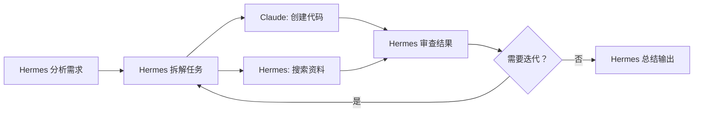

# Hermes + Claude Code 协作范式

## 核心分工

| 角色 | 负责 | 理由 |
|------|------|------|
| **Hermes (DeepSeek)** | 规划、分析、搜索、协调、读TASK.md、**优化prompt**、构造prompt | 持久记忆、工具丰富（搜索/浏览器/会话搜索） |
| **Claude Code** | **所有**编码、测试、文档写作、Git 操作、PR | 编码能力强，支持插件/技能系统 |

### ⚠️ 成本红线：日常编码一律用 flash

**这是用户明确纠正过的最高优先级规则：**

派活给 Claude Code 之前，先判断任务复杂度：
- ✅ **日常编码、测试、实现、Git 操作、内容搜索** — `--model sonnet`（通过 cc-switch 映射到 flash）。便宜，够用。
- ❌ **不要用 opus/pro 做杂活** — 除非涉及架构决策、复杂推理、长文档生成。拿不准时先问用户。

**实际操作规则：** 每个 prompt 都显式指定 `--model sonnet`。默认就是 sonnet（flash），只有用户说「这个用 opus/pro 做」才换。

**模型映射说明：** 用户使用 **cc-switch** (port 15721) 而非 CCX。cc-switch 能正确将 `sonnet` → `deepseek-v4-flash`、`opus` → `deepseek-v4-pro`，所以直接写 Anthropic 别名即可。不再需要写 DeepSeek 原始模型名。

**模型选择评估框架：**

当给用户提出方案时，主动评估每个子任务适合什么模型：

| 适合 Flash | 适合 Pro |
|---|---|
| 机械式实现（基线、可视化、加载器） | 架构决策（评估器 pipeline、模型组装） |
| 标准算法实现（matplotlib 制图、启发式方法） | 数学推理（warmup 调度、IoU 匹配、损失函数） |
| 数据格式转换、字段映射 | 跨模块协调设计 |
| 错误修复（明确定义的 bug） | 边缘情况处理、数据格式分析 |
| 单文件修改 | 多文件系统集成 |
| html/css 视觉调整 | 测试框架搭建 |

**实际操作：** 构造方案时直接标出每项用 flash/pro。用户确认后按标好的模型发任务。

**成本对比
- flash: ~$1 / 29 turns（66 测试，含大量上下文）
- pro: 同样任务可能要 $3-5+

### 用户覆盖：明确说"用 pro"时直接换

当用户说「用 opus／pro，不用吝啬 tokens」「不用省 token」时，这是明确的成本红线覆盖指令。**直接使用 `--model opus`（cc-switch 映射到 pro），不要反问确认。**
- 三次 pro 并行调用实测：$2.37 + $3.20 + $5.34 = ~$10.91 总花费，3 个独立任务同时完成，实际耗时 ≈ 最慢任务（~12 分钟）

### ⚠️ 绝对红线：Hermes 不得代劳实际任务

**这是从用户严厉纠正中学到的最高优先级规则：**

当需要写代码、写文档、改文件、跑测试、创建目录结构时，必须指挥 Claude Code 去做。Hermes 的角色是指挥官，不是士兵。

**错误的做法（被纠正过）：**
- Hermes 直接用 `write_file` 创建项目的 .md 文件（如 schema.md）
- Hermes 直接用 `write_file` 写代码文件
- Hermes 手动执行 git 操作（commit/push）
- Hermes 跳过 Claude Code 直接写设计文档
- Hermes 直接写测试代码、创建配置文件（如 default.yaml）

### 恢复模式：Hermes 已做代码后的回退流程

如果你已经写了代码（违反红线），让 Claude Code 重做是可行的：

1. **Hermes 做还原操作**（这是可接受的例外）：
   ```bash
   git revert <commit-hash> --no-edit    # 回退 Hermes 写的 commits
   git push origin main                   # 推送还原
   ```
   这不算"写代码"，只是恢复 repo 到正确状态让 Claude Code 接手。

2. **构造 prompt 时必须包含 scaffold 上下文**——Claude Code 不知道仓库里已经有什么文件。
   - 读一遍现有的 scaffold 文件（如 `logging.py` stubs）
   - 在 prompt 里写明："The X module is already scaffolded at: <path> with <classes/interfaces>"
   - 否则 Claude Code 可能从头重写或产生冲突

3. **每个原子子任务一个 Claude Code 调用**——不要把 4.1.2 + 4.1.3 打包进一个 prompt。每个 checkpoint 独立 PR。

4. **PR 合并后验证**：`git pull origin main` + 跑全量测试确认没回归。

**正确的做法：**
0. **TASK.md 预检** — Hermes 读 TASK.md，检查*所有*已完成 checkbox 是否都已标记 [x] 并 commit。如果有遗漏（已完成但未标记），**立即补上并 commit + push**，再开始新任务。这是第一步，不可跳过。
1. **先讲解设计，用户确认后再动手** — 执行前先给用户讲清楚"要做什么、为什么、影响是什么"。用简洁的语言描述设计，等用户说"确认"或"好"后再开始。用户偏好先理解再执行。
2. Hermes 读 TASK.md → 找下一个未做 checkbox
3. **Hermes 构造 + 优化 prompt（关键步骤）** — 构造精确 prompt（任务描述 + 文件路径 + 验证标准 + git 步骤）。**构造完后必须对 prompt 做一次自我审查：** 需求是否清晰？文件路径是否准确？Claude Code 有足够的上下文吗（scaffold 文件内容）？git 步骤是否完整？**绝不原样转发原始需求** — 必须把用户的口语化需求翻译成结构化的 Claude Code 指令。
4. Hermes 调用 `terminal(claude --bare ...)` 把任务发给 Claude Code
5. Claude Code 实现 → 测试 → commit → branch → push → PR
6. Hermes 验证结果 → 记录模型用量 → **[必须] 立即更新 TASK.md → commit + push →** 询问用户是否继续

**例外（可以用 Hermes 直接做，不需要过 Claude Code）：**
- 搜索/浏览网页获取信息
- 读文件/看代码理解现状
- 构造 prompt 发给 Claude Code
- 更新 TASK.md 标记完成
- 跟用户沟通汇报
- **数据下载/数据获取** — 下载文件、克隆仓库、设置共享存储、处理大文件。Claude Code 的 sandbox 环境没有下载工具（`wget`/`curl`/`huggingface_hub` 可能不完整），而且大文件下载容易超时。用户明确说过"下载的事情你可以自己完成，不需要过 claude"。
- **基础设施设置** — 挂载 SMB/NFS 共享、创建软链、设置代理等系统级操作。这些是环境配置，不是项目代码。
- **快速验证/探查** — `python3 -c "..."` 跑一小段代码验证某个假设，而不是写测试。
- **Claude Code 反复失败后的接管** — 当 Claude Code 对同一任务做了 2+ 次都达不到要求（尤其是 HTML/CSS 视觉任务），用户会直接说「你别让Claude改了，你自己改一下」。此时 Hermes 应接管直接编辑。用户纠正过：「你别让Claude改了，你自己改一下吧，这玩意根本就不是个流程图」。
- **HTML/CSS 视觉/布局任务** — 当 Claude Code 反复做不对（2+ 次失败），或需要精确匹配某个视觉设计参考时，Hermes 直接编辑。Claude Code 的 sandbox 无法渲染 HTML，无法做视觉验证。

**⚠️ Hermes 直接编辑也必须通过 git worktree 完成。** 用户明确纠正：「开worktree写，为什么你知道让Claude这么做你自己又做不到，记住」。见上方「Hermes 直接编辑 git worktree 流程」。

**判断原则：**
1. "这个任务需要 Claude Code 的编码/推理能力吗？" 如果只是机械执行（下载、复制、检查），Hermes 自己做更快。
2. "这个文件我能不能不写，而是让 Claude Code 来写？" 如果答案是"能"，就交给 Claude。如果答案是不能（没有代码要写，只是基础设施操作），自己来。

### Hermes 直接编辑 git worktree 流程

**用户明确要求：** 当 Hermes 直接做文件编辑（不是通过 Claude Code）时，也必须用 git worktree 隔离操作，不得直接在 main 分支上改。用户纠正过："开worktree写，为什么你知道让Claude这么做你自己又做不到"。

```bash
# 1. 创建 worktree（detached HEAD 模式）
git worktree add /tmp/hermes-<task-name> HEAD

# 2. 复制文件到 worktree
cp <ORIGINAL_FILE> /tmp/hermes-<task-name>/

# 3. 在 worktree 中编辑文件

# 4. 提交（worktree 内 commit）
cd /tmp/hermes-<task-name>
git add <MODIFIED_FILE>
git commit -m "<scope>: <具体的描述>"

# 5. 复制文件回主仓库
cp /tmp/hermes-<task-name>/<MODIFIED_FILE> <REPO_DIR>/

# 6. 在主仓库重新 git add/commit（worktree 是 detached HEAD）
cd <REPO_DIR>
git add <MODIFIED_FILE>
git commit -m "<scope>: <具体的描述>"

# 7. 清理
git worktree prune
```

**注意：** worktree 默认是 detached HEAD——commit 在 worktree 内有效但不在主分支上。需要在主仓库重新 git add/commit。

### ⚠️ HTML 结构完整性验证（修改 HTML 后必做）

**用户经历的教训：** Python 字符串操作（split/join/replace）修改 HTML 文件后，可能静默丢失关键结构性标签，导致页面完全无法渲染。浏览器打开一片空白。

修改 HTML 文件后，**必须**验证以下完整性检查：

```bash
python3 -c "
import re
with open('FILE.html') as f:
    c = f.read()
print('style:', c.count('<style'), '</style>:', c.count('</style>'))
print('head:', '</head>' in c, 'body:', '<body' in c, '</body>', '</body>' in c)
d = len(re.findall(r'<div[\\\\s>]', c))
dc = len(re.findall(r'</div>', c))
print('div:', d, '/div:', dc, 'diff:', d - dc)
"
```

**关键检查项（任一项失败则文件损坏）：**
1. `<style>` 和 `</style>` 数量必须相等（缺失 `</style>` 会导致整页空白）
2. `</head>` 和 `<body>` 都必须存在
3. `<div>` 和 `</div>` 数量必须严格匹配
4. `</body>` 和 `</html>` 都必须存在

**安全的 HTML 编辑方式（优先级从高到低）：**
1. `patch()` — 适合精确查找替换，自动做语法检查
2. **写完整文件** — 如果改动较大，用 `write_file()` 重写整个文件而非局部替换
3. **避免 Python 字符串操作** — `split('\n')` + 行级索引替换 + `'\n'.join()` 容易丢失标签边界。非要这么做时，每次 join 后立即运行完整性检查

### ⚠️ 黄金法则：先优化 prompt，再交给 Claude

这是用户明确要求的核心工作流程原则：

1. **Hermes 先做分析 + 设计决策** — 读文件、理解现状、做设计选择（如三导放第几页）
2. **Hermes 构造精确 prompt** — 包含完整上下文、精确文件路径、具体改动说明、验证标准
3. **交给 Claude Code 执行** — Claude Code 只负责机械执行，不负责设计决策
4. **Hermes 验证结果** — 检查文件结构、git log、测试是否通过

**不要在 prompt 里留模糊地带让 Claude 做设计选择。** 所有的设计决策（放哪里、什么样式、什么内容）都必须由 Hermes 在 prompt 中明确指定。

## 五种协作模式

### 模式 A：One-Shot 编码任务（优先使用 Hermes delegate_task）

Hermes 把独立编码任务交给子代理，子代理完成后返回结构化摘要。

**首选方式（Hermes delegate_task）：**
```python
delegate_task(
    goal="<任务目标 — 一句话描述要完成什么>",
    context="""<完整上下文 — 文件路径、项目结构、约束条件、验证标准、git 步骤>""",
    toolsets=["terminal", "file", "search", "coding"],
)
```

**适用场景：**
- 创建单/多文件模块
- 编写测试并运行
- 代码审查
- Git 操作（commit, PR）
- 超参扫描、实验运行

**优先使用 delegate_task 的理由：**
1. Hermes 自动追踪生命周期、输出、成本
2. 支持并行（`tasks` 数组，最多 3 个）
3. 子代理有隔离的上下文和终端会话
4. 返回结构化摘要，不需要 JSON 解析
5. 不需要 `--bare`/`--dangerously-skip-permissions` 标志

**回退方式（terminal + claude CLI）：**
当子代理的工具集不够用（如需要浏览器自动化、spotify 等），或 delegate_task 的环境限制导致问题时：
```bash
terminal(command="claude --bare --dangerously-skip-permissions --output-format json -p '任务描述'", timeout=600)
```

**返回数据结构（JSON）：**
```json
{
  "result": "Claude 的完整回复（含代码、运行结果）",
  "stop_reason": "end_turn",
  "total_cost_usd": 0.057,
  "usage": {"input_tokens": 9338, "output_tokens": 1049},
  "num_turns": 10
}
```

**Delegate task prompt 构造原则（对比 terminal 模式的新要求）：**

| 维度 | terminal(claude ...) 模式 | delegate_task 模式 |
|------|--------------------------|-------------------|
| 上下文 | prompt 字符串，无需额外字段 | 分为 `goal`（一句话）和 `context`（背景/路径/验证） |
| 文件路径 | 在 prompt 中指定 | 在 `context` 中指定，用绝对路径 |
| 工具 | 隐式继承 Claude 的 sandbox | 通过 `toolsets` 显式指定 |
| Git 操作 | 需要创建 worktree + 指定工作目录 | 子代理有独立 session，cd 到 worktree |
| 验证 | 子代理自己跑测试 + report | 子代理自己跑测试 + return summary |
| 成本跟踪 | `total_cost_usd` 在 JSON 中 | Hermes 自动记录 |

**Prompt 模板（delegate_task 编码任务）：**
```python
delegate_task(
    goal="Phase 4.6.1: 创建训练管线标准化",
    context="""
项目路径: /tmp/bgg-worktree/training-pipeline

你需要:
1. 读 CLAUDE.md 了解代码风格
2. 读 src/bipartite_gnn_gui/data/dataset.py 了解 GUIDataset
3. 创建 src/bipartite_gnn_gui/data/graph_dataset.py — GUIDataset → HeteroData 桥接
...

验证:
cd /tmp/bgg-worktree/training-pipeline
/Users/minimx/bipartite-gnn-gui/.venv/bin/python -m pytest tests/ -v --tb=no -q

Git:
git add <files>
git commit -m "experiment: ..."
git push origin <branch>
gh pr create --title "..." --body "..."
""",
    toolsets=["terminal", "file", "search", "coding"],
)
```

**关键约束（每次写 prompt 前自检）：**
- [ ] 子代理没有 Hermes 的会话记忆——所有上下文必须在 context 中写全
- [ ] 文件路径必须绝对路径——相对路径在子代理的 cwd 中可能不解析
- [ ] `.venv` 路径必须写完整——子代理不继承父的 shell 环境
- [ ] 验证步骤必须写完整命令（`python -m pytest tests/test_xxx.py -v`）
- [ ] git 步骤必须完整（add → commit → push → PR）
- [ ] 如果路径包含 `data/rico_local/combined` 等相对数据，需要用绝对路径或在 context 中指定

### 模式 B：带插件执行

加载 awesome-claude-plugins 中的插件来增强 Claude 能力。

```bash
claude --bare --plugin-dir /path/to/code-review \
  --plugin-dir /path/to/commit \
  --dangerously-skip-permissions \
  -p "任务描述"
```

**已测试可用的插件：**
- `code-review` — 代码审查
- `commit` — 生成 commit message
- `pr-review` — PR 审查
- `create-pr` — 自动创建 PR
- `changelog-generator` — 生成 changelog
- `debugger` — 调试辅助
- `connect-apps` — 连接 500+ 应用（需要 Composio API key）
- `frontend-design` — 前端设计
- `backend-architect` — 后端架构

**安装方式：**
```bash
git clone --depth 1 https://github.com/ComposioHQ/awesome-claude-plugins.git /path/to/plugins
```

### ⚠️ 前置检查：加载已有技能

开始任何任务前，先扫描 available_skills。如果存在相关技能，必须先 `skill_view()` 加载它。**不要自行生成新的 workflow 文档或实验协议**——已有的技能很可能已经覆盖了。用户纠正过："生成这些东西干什么？不是本来就有规范吗？"

例外：确认没有匹配技能后，才考虑创建新文档。创建前先问用户确认。

### ⚠️ SMB/网络故障排查：先查密码和连接

当遇到"Blocked — SMB 挂载为空"时，不要直接标记阻塞。三步排查：
1. `ping -c 2 <IP>` 确认主机在线
2. `smbutil view //user@IP/` 或 `smbclient -L //IP -N` 测试认证
3. 如果 ping 通但 auth 失败 → 密码不对。先试已知密码再报告阻塞

**密码 061127** 记在 skill `thinkpad-smb-access` 中。不要假设密码失效或 ThinkPad 离线。

### ⚠️ 前置检查：claude 二进制路径验证

Spawn Claude Code 前执行 `which claude` 确认路径。Claude 安装在 `~/.npm-global/bin/claude`，**不是** `.venv/bin/claude`。这是最常见的 spawn 失败原因（exit code 127）。在 prompt 中写完整绝对路径 `~/.npm-global/bin/claude`，不要依赖 PATH 或 venv。

### Phase-Based 项目开发（TASK.md 驱动）

适合有清晰任务拆解的大型项目（研究项目、多模块系统）。工作流：

```
Hermes: 读 TASK.md → 找下一个未做 checkbox
     ↓
Hermes: 向用户讲解设计（做什么、为什么、影响），等待确认
     ↓ 用户说"确认"或"好"后继续
Hermes: 构造精确 prompt（任务描述 + 文件路径 + CLAUDE.md 上下文）
     ↓
terminal(claude --bare --dangerously-skip-permissions --output-format json -p '...')
     ↓
Claude Code: 读 CLAUDE.md → 实现代码 → 跑测试 → git add/commit → branch → push → PR
     ↓
Hermes: 验证结果 → 记录模型用量 → 更新 TASK.md → 询问用户是否继续
```

**关键约定：**
- TASK.md 是唯一真相源，每个 checkbox = 一条 PR
- Claude Code prompt 必须包含：what（做什么）、where（文件路径）、verify（验证标准）、**git 步骤（add/commit/push/PR）**
- **每个子任务完成后必须 commit & push**（用户偏好）。不做大积压，每步一个独立提交。
- **Hermes 不得代 Claude Code 写任何代码或文档**（用户严厉纠正过的规则）。指挥，不执行。
- **Git worktree 是强制方式** — 所有 Claude Code 任务必须通过 worktree 隔离执行，不得在 main 分支直接操作。
- **Commit message 必须清晰有含义** — 格式如 `feat: 添加IPO竖向流线展示` / `fix: 修复transition桥接箭头偏移`。禁止 `update`、`fix`、`changes` 等无含义的单字提交信息。
- 不使用 `delegate_task` 做编码——Claude Code 在 sandbox 里跑比 subagent 更自然
- 不使用 Kanban——Hermes + Claude Code 两角色就够了
- 每个子任务完成后问用户要不要继续，不一股脑做完
- Research skills（文献搜索、论文写作）只在需要时按需加载

**Prompt 模板（编码任务 - Phase 4，含 scaffold 上下文）：**
```bash
# 最佳实践：先写入临时文件，避免 shell escaping 问题
# 在 prompt 中包含 scaffold 文件内容和精确路径，否则 Claude Code 不知道仓库里有啥
cat > /tmp/prompt_xxx.txt << 'PROMPT_END'

TASK: <任务描述>

CONTEXT: <项目背景>。Read CLAUDE.md at the repo root for behavioral rules and code style.

WHAT YOU NEED TO DO:
<详细的任务说明，包含已有文件路径、需要创建/修改的文件>

VERIFY: Run `python -m pytest <test_path> -v` after implementation.
Then run `python -m pytest tests/ -v` — all existing tests must still pass.

After implementation and verification:
1. git checkout -b <branch-name>
2. git add <files>
3. git commit -m "<area>: <description>"
4. git push origin <branch-name>
5. gh pr create --title "<title>" --body "<body>"
PROMPT_END

# ⚡ 模型别名规则：用 `--model sonnet`（cc-switch 映射到 deepseek-v4-flash）
# 不要写 `--model deepseek-v4-flash`（除非显式需要 bypass 别名映射）
terminal(command="cd <REPO_DIR> && claude --model sonnet --bare --dangerously-skip-permissions --output-format json -p \"$(cat /tmp/prompt_xxx.txt)\"", timeout=600)
```

关键原则：**必须包含 scaffold 上下文**。Claude Code 没有 Hermes 的 session 记忆。
- 列出所有相关的已存在文件路径
- 说明哪些是 stubs，哪些是完整实现
- 明确需要创建 vs 需要修改的文件
- 提供精确的 VERIFY 命令（具体到文件级别的 pytest 命令）
- 包含完整的 git/PR 步骤，否则 Claude Code 不会做 git 操作
- timeout 用 600（4.1.3 logging 用 19 turns/141s 完成，默认 180 可能不够）

> 提示构造例子： 见 `references/phase-prompts.md`（编码任务 prompt 模板）
> 违反检测实验设计： 见 `references/gnn-violation-experiment.md`
> HuggingFace 数据集下载模式见 `references/huggingface-dataset-download.md`
> 真实 VLM 端到端管线评估方法见 `references/real-vlm-pipeline-methodology.md`
> GUI 数据集调研见 `references/gui-datasets-survey.md`
> NaN 损失排查指南见 `references/nan-loss-empty-tensors.md`\n> MySQL Docker 编码陷阱（含中文的 SQL 写入 utf8mb4 列）见 `references/mysql-charset-docker.md`\n### Git Worktree 工作流（用户强制要求）

**用户明确要求：所有 Claude Code 任务必须用 `git worktree` 完成。不得直接在 main 分支上操作。**

原因：worktree 提供完全隔离的工作目录，Claude Code 可独立在其中读写而不影响主仓库状态。Hermes 在 prompt 中负责设置 worktree。

```bash
# Hermes 侧：创建 worktree（在构造 prompt 时执行）
git fetch origin
BRANCH="feat/<descriptive-name>"
git checkout -b "$BRANCH" origin/main     # 在原始仓库创建分支
git push origin "$BRANCH"                  # 推送到远端（sandbox 可以 pull）
git checkout main                           # ⚠️ 必须切回 main！否则 worktree add 会报
                                            # "fatal: 'BRANCH' is already used by worktree at <CWD>"
WORKTREE_PATH="/tmp/worktree-$(date +%s)"
git worktree add "$WORKTREE_PATH" "$BRANCH"
```

然后在 prompt 中让 Claude Code ：
1. `cd <WORKTREE_PATH>`
2. 修改文件
3. `git add . && git commit -m "<清晰的commit信息>"`
4. `git push origin <BRANCH>`
5. `gh pr create ...`

**提示模板中的 git 步骤应改为：**

```
After implementation:
1. cd <WORKTREE_PATH>
2. git add <files>
3. git commit -m "<范围>: <具体的描述>"
4. git push origin <BRANCH_NAME>
5. gh pr create --title "<清晰标题>" --body "<说明>"
```

**提交信息质量要求：** 用户要求"清晰的comment"。commit message 必须有意义，格式如 `feat: 添加IPO竖向流线展示` 或 `fix: 修复transition桥接箭头偏移`。禁止用 `update`、`fix`、`changes`等无含义的单字。

**Hermes 后处理：**
- 等 Claude Code 完成后，Hermes 清理 worktree:
  ```bash
  cd <REPO_DIR>
  git worktree remove "$WORKTREE_PATH"
  ```
- 合并 PR 后删除远端分支

### Prompt 模板（文档任务 - Phase 1-3）
```python
terminal(command=f"""cd {REPO_DIR} && claude --model sonnet --bare \
  --dangerously-skip-permissions --output-format json -p '
Step 1: Read these files for context:
- <list of existing docs and source files>

Step 2: Create <file_path> with content:
<section details>

Step 3: Commit and push:
git add <file>
git commit -m "docs: <description>"
git push origin main
'""", timeout=600)
```

### 运行时监控：不要假设「正常运行中」，几分钟无输出就要查

Claude Code 后台任务可能看似在运行实则卡住。**收到 notify_on_complete 通知之前，如果怀疑卡了，主动诊断而非假设正常。**

**关键启动时机：后台任务运行超过预期时间（如 Docker 编译超 5 分钟、普通构建超 2 分钟）且无输出变化时，立即诊断，不要等用户来问「？」或「你放屁吧」。** 用户会认为你不分析问题直接摆烂，这是严重失职。

```bash
# 1. 检查进程是否存在及 TTY
ps aux | grep claude | grep -v grep

# 2. 读 session 状态文件（看 status/waitingFor/updatedAt）
cat ~/.claude/sessions/<PID>.json

# 3. 如果 status=waiting, waitingFor=dialog open → 卡在对话框，需要人为干预
# 4. 如果用 lsof 看到子进程（如 container build），检查其状态
# 5. 检查文件系统是否有部分产出物（如 .tar 是否在增长）
```

详见 `references/debug-stuck-claude-session.md`。

**什么时候干预（用户明确的期望标准）：**
- 后台任务运行数分钟无输出 → 立即用 `lsof -p <PID>` 诊断，不要假设「在运行就是正常的」
- `status=waiting` → 必须用户干预或 kill
- 工具调用的重试循环 → kill 后修正 prompt 重来
- 输出 10+ 分钟没变化 + 子进程无 I/O → kill，换更快的本地方式直接做
- 子进程在做实际的网络/文件 I/O → 继续等，但检查速度是否合理（对比带宽/网速判断是否卡住）

### Post-Claude 验证清单（Claude Code 返回后必查）

1. **PR 存在** — `gh pr view <number>` 确认 PR 已创建，title/body 正确
2. **测试通过** — 检查 JSON result 含 PASSED。跑全量: `python -m pytest tests/ -v`，测试数 >= 之前
3. **代码风格** — 快速扫改过的文件：Google-style docstrings, type annotations, 无 wildcard imports
4. **Commit message 质量** — 验证 commit message 有意义（非 `update`/`fix`/`changes`），格式规范。若不合格，在 PR merge 前让 Claude Code 重写。
5. **清理 worktree** — `git worktree remove <WORKTREE_PATH>` 清理临时目录
6. **更新 TASK.md** — 切回 `main` 分支，将对应 checkbox 从 `- [ ]` 改为 `- [x]`，加上 PR 编号。commit + push 到 `main`。这是**与 Claude Code 共享的进度真相源**，用户明确要求必须在 TASK.md 中表示进度
7. **记录模型用量** — 从 JSON 结果中提取 `usage.input_tokens`、`usage.cache_read_input_tokens`、`usage.output_tokens`，按 DeepSeek 官价（flash/pro 各自的缓存命中/未命中/输出价格）计算实际 CNY 花费，追加到项目 `.hermes/cost-tracking.json`。**不要用 `total_cost_usd`**（那是 Anthropic 牌价，比实际 DeepSeek 价格贵几十倍）。详见 skill `deepseek-cost-tracking` 和脚本 `~/.hermes/scripts/track_usage.py`。
8. **TASK.md 同步验证** — 确认改动的 checkbox 对应的是正确的 PR 编号，git log 里有这次提交

⚠️ **关于"重新开始对话后进度丢失"**：Hermes 的 session 记忆不会跨会话自动延续。如果你在一轮对话里完成了 Phase 4.2.3 但没有更新 TASK.md，那么下一轮对话即使读到 TASK.md，看到的 checkbox 还是 [ ]。**更新 TASK.md + push 是唯一的跨会话进度持久化手段**，比 memory 工具可靠。每个 Claude Code PR 合并后，必须立刻更新 TASK.md 并 push。

任何一项不通过 → 不要手动修，重新构造 prompt 让 Claude Code 修。

### Proxy 预检（构造 prompt 前）

确认 git push 不会在 sandbox 内挂起：

```bash
# 检查当前的代理设置
git config --global http.proxy   # 应为 socks5://127.0.0.1:1082
lsof -i :1082                    # Shadowrocket 应监听

# ⚠️ proxy 503 时：不要用 --unset，要用空字符串
# --unset 会让 git 回退到 $http_proxy 环境变量（仍然走代理）
# 设为空字符串 "" 会覆盖环境变量，彻底 bypass
git config --global http.proxy ""    # bypass 代理（覆盖 env var）
git config --global https.proxy ""   # HTTPS 也要设
# 恢复时再设回来：
git config --global http.proxy socks5://127.0.0.1:1082
git config --global https.proxy socks5://127.0.0.1:1082
```

### GitHub 连通性诊断（当 git push 返回 502/503 时）

在国内，GitHub 可能因 GFW TLS 干扰间歇性不可用。诊断步骤：

1. **区分问题类型**：
   - Ping 通 + nc 能连 443 + TLS 握手卡住 → GFW 干扰（最常见）
   - 完全连不上 → 代理问题
   - DNS 返回非预期 IP → ISP DNS 污染

2. **诊断命令**：
   ```bash
   ping -c 2 github.com              # 网络可达性
   nc -z -v -G 3 github.com 443      # 端口可达性
   curl -s -o /dev/null -w "%{http_code}" --max-time 5 --noproxy '*' https://github.com  # 直连
   curl -s -o /dev/null -w "%{http_code}" --max-time 5 https://github.com               # 通过代理
   ```

3. **修复**：
   - 等待重试（GFW 干扰通常是间歇性的）
   - 重启 Shadowrocket VPN 换出口 IP
   - 如果 github.com 返回 503：等几分钟再试，是 GitHub 服务端问题

4. **本地 commit 策略**：git 本地 commit 不依赖网络。如果 push 失败但 commit 已做好，通知用户稍后重试 `git push`。

> ⚠️ **TASK.md 不是 Hermes 的私有笔记——它是 Hermes 与 Claude Code 之间的共享状态文件。** Claude Code 每次启动都读 TASK.md 来决定做什么；如果 checkbox 没更新，Claude Code 看到的进度是错的，可能重复做已完成的工作或跳过未做的工作。这是用户明确纠正过的关键规则。

**⚠️ TASK.md Phase 编号规则：** Phase 编号必须按执行优先级顺序排列，不是按方法论阶段编号。Phase 7 完成后，Phase 8 必须是下一个实际要做的事，不是推到后面的阶段。用户纠正过：「TASK文档很重要，既然9和10要到后面做，就不要把这个写成11，一定要注意顺序」。即使工程方法论上 8→9→10 是方案→WebDemo→代码生成，但如果下一步受控实验更优先，就把它编成 Phase 8，Demo/代码生成往后排。

**TASK.md 维护原则（不可跳过）：**
- Hermes 负责读和更新 TASK.md，Claude Code 不碰它（避免冲突）
- checkbox 完成 → `- [x]` 标记并单独 commit，注明 PR 编号
- **⚠️ TASK.md 编辑陷阱**：`read_file` 的输出格式为 `LINE_NUM|CONTENT`。patch() 的 old_string/new_string 中填写文件实际内容时，**不要混入行号前的 `|` 分隔符**——那是 read_file 的显示格式，不是文件的实际内容。正确做法：用 `search_files` 定位原文，或直接在终端 `grep -n` 确认精确文本后再 patch。将 read_file 输出中的行号+管道符一并复制到 patch 参数中，会导致文件被注入多余的管道符。
- 发现缺失子任务 → 先问用户再补充
- **每个已完成子任务（Claude Code PR merge 后）Hermes 必须立刻去更新 TASK.md**。这是与 Claude Code 共享进度状态的唯一通道，用户明确要求。
- **TASK.md 预检**：每次开始新任务前，先读 TASK.md，检查是否有已完成但未标记 [x] 的 checkbox。如果有，先补上再推进。否则 Claude Code 看到的进度永远是落后的。
- **Phase 顺序不可跳跃**：用户明确要求 Phase 1（需求分析）→ 2（概要设计）→ 3（详细设计）→ 4（开发），前三阶段的文档产出必须在写代码之前完成。已存在的 Phase 4 代码（如从 PR 合并来的）标记为待重写，不要直接继续开发。

### 模式 E：CLAUDE.md 注入 Karpathy 行为准则

适合约束 Claude Code 行为方式的仓库。从 Karpathy 公开 CLAUDE.md 注入 5 条：

1. **Think Before Coding** — 说出假设，暴露不确定性
2. **Simplicity First** — 最少代码，不超前抽象
3. **Surgical Changes** — 只动要动的，不改无关代码
4. **Goal-Driven Execution** — 用测试驱动而不是"感觉对了"
5. **Ship Incrementally** — 每个完整工作单元一个 PR

**注入方式：** Claude Code 读当前 CLAUDE.md → 以 Behavioral Guidelines 节插入顶部 → 保留项目原有内容。来源：https://github.com/multica-ai/andrej-karpathy-skills/blob/main/CLAUDE.md

### 模式 F：批量执行模式（User-Trusted 多步连跑）

适用于用户明确说"全部你自己按顺序完成，无需经过我任何确认"的场景。Hermes 按顺序逐个派给 Claude Code，完成后自动合并、更新 TASK.md、继续下一个。

**流程：**

```
用户: "4.3.2到4.3.5全部你自己按顺序完成"
     ↓
Hermes: 读 TASK.md → 确认范围
     ↓
Loop:
  1. 构造 prompt → terminal(claude --model flash ...)
  2. 收到 JSON → gh pr merge --squash
  3. 记录模型用量到 .hermes/cost-tracking.json
  4. 更新 TASK.md checkbox → commit + push
  5. 继续下一个
     ↓
完成: 汇报汇总（PR 列表 + 测试数 + 花费）
```

**触发条件：** 用户必须明确授权（"全部自己做""无需确认"等）。没有授权时依然是逐个问。

**注意事项：**
- 每个子任务仍然是独立 PR（不因为批量就打包）
- **[内容类任务优化]** 对于非代码的内容产出（政策入库、文档批量生成、方案撰写），可以用**单一分支 + 多 commit + 最后统一 PR**取代逐子任务 PR，减少 PR 噪音。每步独立 commit 即可，最后同时创建 PR → merge。
- 如果某个子任务中 Claude Code 请求决策，**不可跳过**——此时用 pro 模型做深度思考，做出合理选择，然后继续
- 每步仍然要记录模型用量和更新 TASK.md（这是强制规则）
- 即使批量模式也要在最后汇报完整汇总

### 模式 G：Git Worktree 单文件/设计稿类任务

适用于**修改已有文件**（如 HTML 报告、文档、配置文件）而非创建新模块的任务。与标准分支模式的区别：

| 维度 | 标准分支模式（D） | Git Worktree 模式（G） |
|------|------------------|----------------------|
| 适用场景 | 创建新模块、写测试、多文件新增 | **修改已有文件**、HTML 重排、文档更新 |
| Git 操作 | `checkout -b` → push → PR → merge | `worktree add` → 原地改 → commit → 拷贝回主仓库 |
| 提交策略 | 每个 checkpoint 一个 PR | 2-3 个清晰的独立 commit，不 push |
| 文件来源 | Claude 在 repo 内直接工作 | Claude 将原文件 cp 到 worktree 再改 |

**工作流：**

```
Hermes: 读文件 → 分析现状 → 做设计决策 → 构造精确 prompt
     ↓
terminal("claude --model sonnet --bare --dangerously-skip-permissions --output-format json -p '...'", timeout=600)
     ↓
Claude Code 执行：
  1. git worktree add /tmp/<branch-name> HEAD
  2. cd /tmp/<branch-name>
  3. cp <原文件> ./  # 如果是主仓库外的路径
  4. 做所有改动（HTML/CSS/文本）
  5. 验证文件结构正确
  6. git add/commit（每个原子改动独立提交，清晰描述）
  7. cp 改好的文件回主仓库
  8. git worktree remove /tmp/<branch-name>
     ↓
Hermes: 验证结果 → 记录模型用量 → 汇报给用户
```

**Prompt 模板（HTML/设计稿修改）：**

```bash
terminal(command="cd <REPO_DIR> && claude --model sonnet --bare --dangerously-skip-permissions --output-format json -p '
TASK: <具体描述，如"Redesign Page 5 的表格为4个卡片模块">

CONTEXT: 这是一个 <项目描述>。

WORKTREE WORKFLOW (MANDATORY):
1. git worktree add /tmp/<branch-name> HEAD
2. cd /tmp/<branch-name>
3. 如果文件在主仓库外：cp <原文件路径> ./
4. 完成所有改动
5. 验证文件结构
6. 提交清晰的 commit（2-3个原子提交）
7. cp 文件回主仓库
8. git worktree remove /tmp/<branch-name>

=== 改动 1：<改动描述> ===
<精确的位置和内容描述>
<需要替换/插入的代码>

=== 改动 N：... ===

=== 验证 ===
<检查项列表>

=== 提交策略 ===
<commit message 模板>
"', timeout=600)
```

**提示构造原则（prompt-optimize-first）：**
- Hermes 必须先读文件，理解结构，做好设计决策
- prompt 中指定所有精确改动位置（行号范围或锚点文本）
- 包含确切的 HTML/CSS 代码片段
- 明确"改什么"和"改成什么"，不给 Claude 留设计决策空间
- 提交策略明确写进 prompt（多少个 commit，每个什么 message）

**HTML 可视化设计原则（避免「好乱」陷阱）：**
- **优先干净节点+箭头布局** — 不要设计复杂的嵌套 CSS 布局来做流程图。用户偏好 Mermaid-style 的简单节点排成行，箭头连接
- **Mermaid 图就是规范** — 当用户提供 Mermaid `flowchart LR` 代码作为参考，必须严格再现**每一个节点、每一条箭头、每一个标签**。不能省略、不能合并、不能重新分组。用户纠正过：「这玩意根本就不是个流程图」
- **一个连续流程图，不分段** — 三层标注用左侧**连续竖线**（渐变金→蓝→绿）加三个纵向文字标签。不要用三个独立的色块/区段（用户纠正过：「我要的只是一整个流程图，不是分三部分的」）
- **分层标注用括弧/竖线** — 不要用色块包围/嵌套来区分区域。用左侧彩色竖线 + 纵向文字标注分层归属更简洁美观
- **给 Claude 展示 Mermaid 参考图** — 用 `flowchart LR` 格式描述节点位置关系，比纯文字描述更清晰
- **明确说「不要做什么」** — 如「不要复杂的水平分区，只加三个括弧」比只描述目标更有效
- **跨层角色用边框高亮** — 出现在多层中的角色（如知识运营经理），用 `border-color: var(--gold)` 等简单 CSS 标注即可
- **CSS 用 `linear-gradient` 实现渐变色竖线** — 连续跨层的彩色竖线用 `background: linear-gradient(...)`，别用多个伪元素拼接

**实际例子：** 见 `references/prompt-html-redesign.md`（此 session 的 Page 5 重构案例）
> 数据格式分析： 见 `references/data-format-gap-analysis.md`（CLI prompt 模式 + ScreenSpot/GUI-360 实际案例）
> GNN 视觉特征融合（vit_tiny + cross-attention）见 `references/gnn-visual-feature-fusion.md`
> HF 模型下载代理故障排查见 `references/hf-model-download-proxy.md`
**流程图例子：** 见 `references/prompt-html-flowchart.md`（此 session 的 Page 6 三层括弧流程图案例）
**Mermaid→HTML 翻译规范：** 见 `references/mermaid-to-html-flowchart.md`（精确的节点/箭头映射表）
> 提示构造例子： 见 `references/phase-prompts.md`（编码任务 prompt 模板）
> 违反检测实验设计： 见 `references/gnn-violation-experiment.md`
**Docker 构建 on macOS：** 见 `references/docker-macos-build.md`（apple/container → Linux VM）

### 模式 I：并行多 Agent 工作流（Parallel Multi-Agent Workflow）

Also see `references/multi-agent-research-review.md` for a variant focused on research direction decisions with persona-based subagent reviewers.

适用于**多个独立子任务可同时进行**的场景——任务之间没有文件冲突，工作内容完全隔离。

**触发条件：** 用户说"开三个session同时做"、"并行做"、或明确提出多个无依赖的子任务。

**核心流程：**

```
Hermes: 确认任务是否真正独立（没有文件冲突 / 没有时序依赖）
     ↓
Hermes: 为每个任务创建 worktree + 分支 + 独立 prompt
     ↓ 并行启动
Claude A (worktree-A): 实现任务 A → commit → push → PR
Claude B (worktree-B): 实现任务 B → commit → push → PR
Claude C (worktree-C): 实现任务 C → commit → push → PR
     ↓ 各自独立运行
Hermes: 等待所有 session 完成 → 逐个验证 → 逐个 merge PR
```

**Prompt 构造要点（与单任务的关键差异）：**
- 每个 task 的 prompt 必须**完全自包含**——没有跨 session 的上下文依赖
- 都指明 `cd /tmp/worktree-xxx/` 作为工作目录（不同 worktree 隔离）
- 每个 prompt 都包含「Read CLAUDE.md」 + 「Read all relevant files」 + 完整代码样式规则
- verify 步骤必须是完整的独立命令（`python -m pytest tests/test_xxx.py -v`）
- git 步骤完整：add → commit → push → PR，**每个任务在自己的分支上独立操作**

**优点：**
- 3 个独立任务可同时完成，总耗时 ≈ 最慢一个任务的时间
- Worktree 隔离确保了文件不冲突
- 各自有独立的分支和 PR，review 时可独立合并

**限制：**
- ❌ 不能用于有文件冲突的任务（如两个人改同一文件）
- ❌ 不能用于有时序依赖的任务（B 依赖 A 的输出）
- ✅ 适合：**独立模块开发**（model 层 / data 层 / graph 层各不冲突）、**不同数据集加载器**、**独立的功能模块**

### 子模式 — 用户反馈驱动的并行改动：** 当用户确认了多条修改建议后，将每条独立改动拆分为独立分支 + worktree 并行执行。做法见 `references/change-request-clarify-workflow.md` 的「确认后的批量执行」节。

**子模式 — delegate_task 并行分批：** 当改动数量多（5+项）且涉及不同文件，可用 `delegate_task(tasks=[])` 分批派发（每批最多 3 个），每批完成后继续下一批。每个子代理在自己的 worktree 分支上工作。详见 `references/multi-batch-parallel-pattern.md`。

**Pitfall — 数据格式假设 vs 实际数据不匹配（$2.30 的教训）：**

| 参考 | 说明 |
|------|------|
| 实验设计 confound 检查 `references/experimental-confound-checklist.md` | 多变量同时改变的常见陷阱，实验前后必查 |

当派 Claude Code 写数据加载器时，Hermes 必须先**亲自读实际数据文件验证格式假设**，不能只看文档或 GitHub README。RICO 加载器就是反面教材：文档写 `bounds: "[x1,y1][x2,y2]"`、`root` 在顶层，实际数据是 `bounds: [x1, y1, x2, y2]`（整数数组）和 `activity.root` 层级。加载器写好后不得不花 $2.30 让 Claude 重写。

**正确的预检流程：**
```bash
# Hermes 亲手验证前 3 个样本的实际结构
python3 -c "
import json
with open('data/raw/dataset/sample1.json') as f:
    d = json.load(f)
print('Top keys:', list(d.keys()))
# 检查 bounds 是字符串还是数组
root = d.get('root') or d.get('activity', {}).get('root', {})
print('bounds type:', type(root.get('bounds')), 'value:', root.get('bounds')[:20] if isinstance(root.get('bounds'), str) else root.get('bounds'))
"
```

**写入 prompt 前必须确认的清单：**
- [ ] 实际打开 2-3 个样本 JSON，验证 top-level keys
- [ ] `bounds` 是字符串 `"[x1,y1][x2,y2]"` 还是数组 `[x1, y1, x2, y2]`？
- [ ] `screen_width/height` 是独立字段还是需要从 `root.bounds[2]/[3]` 推导？
- [ ] 数据是单文件、多文件、还是 per-directory 组织？
- [ ] 图片后缀是 `.png` 还是 `.jpg`？
- [ ] 字段名跟文档一致吗？（如 `content-desc` 是字符串还是 `[null]` 列表）
- [ ] 如果有 Semantic Annotations 版本，验证其结构是否与原始版本不同

每项确认后，把实际格式写进 prompt（不要引用文档），Claude Code 直接按实际数据写代码。

**Pitfall — tar 解压到 SMB 极度缓慢：**

通过 SMB 解压大 tar.gz（6 GB, 72K 小文件）预计耗时 2+ 小时，因为每个文件都要经过网络写一次。`lsof -p <PID>` 可确认进程是否仍在写文件。

**正确做法：**
```bash
# ❌ 错误：直接解压到 SMB 挂载点（极慢）
# ✅ 正确：解压到本地 SSD，后续再决定是否拷贝
mkdir -p data/local_extracted
tar xzf /path/on/smb/file.tar.gz -C data/local_extracted

# 如果需要放回 SMB，用 rsync 或 cp -r 一次过
cp -r data/local_extracted /path/on/smb/
```

检测 tar 是否卡住：`lsof -p <PID>` 看 FD 5w（写文件描述符）是否在变化。如果 60 秒内文件没变，就是 I/O 阻塞。

**Session 事后处理：**
1. 逐个检查每个 session 的完成状态
2. 验证测试通过 + PR 存在
3. **处理 merge conflicts**——并行分支可能修改了同文件（如 ground_truth.py 被 A 和 C 同时改）。在第一个 PR 合并后，后续 PR 需要 rebase/merge origin/main 并解决冲突。在 worktree 内 `git fetch origin main && git merge origin/main`，手动解决冲突后 commit + push
4. **验证测试通过**——合并冲突解决后，必须在 worktree 内重新安装包再跑全量测试：`/path/to/.venv/bin/pip install -e . && /path/to/.venv/bin/python -m pytest tests/ -v`
5. 合并 PR → 删除分支 → 清理 worktree
6. 更新 TASK.md 标记多个 checkbox
7. 记录每次调用的模型用量（distinct costs）

**Pitfalls:**
- ⚠️ **worktree 中的 pip install**：worktree 使用主仓库的 `.venv`，但 pip 安装时会把当前目录的包注册到 venv。从 worktree 跑测试前，需要重装：`.venv/bin/pip install -e .`，否则 import 的还是主仓库的旧版本代码
- ⚠️ **并行任务的文件冲突**：即使任务主题不同（如 data loader A 和 data loader C），也可能都改了 `__init__.py`、`ground_truth.py`、`dataset.py` 等公共文件。第一个 PR 合并后，后续 PR 必然有冲突。构造 prompt 时预判冲突点，在 prompt 里注明「This task modifies files XXX that another parallel task may also touch — expect merge conflicts」
- ⚠️ **合并冲突解决流程**：当并行分支都修改了相同文件，后续 PR 需要手动 resolve：
  1. 在 worktree 内 `git fetch origin main && git merge origin/main`
  2. 手动对比两个分支的变更，保留两者的逻辑，用 `patch()` 修复冲突
  3. `git add <resolved-files> && git commit -m "merge: resolve conflict with <other-branch>"`
  4. `git push origin <branch>`
  5. 确认测试通过：`.venv/bin/pip install -e . && .venv/bin/python -m pytest tests/ -v`
  6. 然后 `gh pr merge <number> --squash`
- ⚠️ **模型选择**：用户说「用 opus，不用吝啬 tokens」时，直接用 `--model opus`（cc-switch 映射到 pro）。

> 反向模式（Claude 规划→Hermes 执行）见 `references/reverse-planning-execute-pattern.md`
> 反向模式案例（日志方案）见 `references/reverse-logging-plan-prompt.md`
> 实际 prompt 例子见 `references/2026-06-22-screenspot-adapter-prompt.md`
> 实际 prompt 例子见 `references/2026-06-22-model-layer-prompt.md`
> 实际 prompt 例子见 `references/2026-06-22-rico-loader-prompt.md`
> NaN 损失排查指南见 `references/nan-loss-empty-tensors.md`
> HTML 大文件精确修改（patch() 失败时的降级策略、`\n` 字面量陷阱、字符串拼接行移除）见 `references/change-request-clarify-workflow.md`

### 模式 J：结构化内容工作空间搭建（非代码知识库/方案/咨询类项目）

适用场景：内容创作、咨询方案、知识库搭建、模板+预制计划体系等**非代码输出**的工作空间。典型特征：输出是 .md 文档/提示词/模板，无需 git/PR，无需自动化测试，最终以复用为目的。

**与编码模式的核心区别：**

| 维度 | 编码模式（D/F/G/I） | 内容搭建模式（J） |
|------|------------------|------------------|
| 输出 | 代码/测试/PR | 结构化文档、模板、提示词集合 |
| 版本控制 | Git branch → PR → merge | 可选 git，仅用于基础追踪 |
| 验证方式 | 自动化测试 + CI | 人工审核 + 端到端假想案例跑通 |
| 复用方式 | 模块/库/组件 | Skill 打包 + 模板体系 |
| 用户角色 | 开发者 | 领域专家（医生、教练、顾问） |

**6 步工作流：**

```
Phase 1 — 了解全景
  > 先问"你要什么"而不是直接开工
  > 用户可能说"先列个计划" → 创建 TASKS.md
  > 不要在没有全景图时写任何内容文件

Phase 2 — 规则固化
  > 用户提出约束性要求（对齐颗粒度、边问边记等）
  > 立即写入 CLAUDE.md 作为强制规则

Phase 3 — 分类体系设计
  > AI 提出分类维度 → 精简为最简可行集
  > ⚠️ 用户确认后再推进，避免白做

Phase 4 — 模板 + 批量内容生成
  > 先创建模板骨架，再批量填充内容
  > 尝试 subagent 并行加速，但提前准备串行降级
  > ⚠️ 每个文件独立完整可交付，不自相引用

Phase 5 — 端到端验证
  > 创建假想用例走完全流程（模板→匹配→个性化→交付）
  > 检查所有产出物是否完整可用

Phase 6 — 打包为 Skill
  > 将工作流固化为 SKILL.md
  > 可选 zip 打包到桌面备用
```

**核心原则：**
1. **Plan first** — 方案没确认前不写任何内容
2. **One question batch** — 一次性追问完所有缺失信息
3. **Record as you go** — 每回答一个问题立即写入文档
4. **Classify before generate** — 分类结构先确认再批量生成
5. **Fabricated test case** — 自建案例跑通全流程
6. **Package as skill** — 交付不结束于文档，结束于可复用工作流

> 实际案例见 `references/content-workspace-case-study.md`（医生增肌减脂咨询工作空间搭建）

### Research Workflow Mode: Hypothesize → Multi-Agent Review → Controlled Experiment → Report

适用于 ML 研究项目的实验循环。工作流：

```
Hermes: 设计实验方案（hypothesis + method + success criteria）
     ↓
Hermes: 并行派发 2-3 个 persona-based 子代理做学术评审
         - 批判学者：挑方法论漏洞、confound、替代解释
         - 实战工程师：聚焦可用性、部署成本、实际价值
         - (可选) 研究战略：看整体叙事、贡献点
     ↓
Hermes: 综合评审意见 → 修改实验方案 → 用户确认
     ↓ 用户确认后
Hermes: 构造 prompt → Claude Code (worktree)
     ↓
Claude Code: 实现实验脚本 → 跑实验 → commit → PR
     ↓
Hermes: 同步结果到 TASK.md → 是否更新方向决策→ 询问用户
```

**关键约束：**
- 实验方案必须写清楚 **success criteria + abandon criteria**（什么条件下停）
- 子代理可以 **WEAK KEEP / STRONG KEEP / DROP** 给每个假设打分
- 每个实验只变**一个变量**（防 confound，见 `references/experimental-confound-checklist.md`）
- 跑5个 seed 算 mean ± std，报置信区间
- **真实数据优先于合成数据**：合成 deletion 不能替代真实 VLM 误差分布
- 在 SMB、网络、基础设施方面遇到 ❌ Blocked 时，先尝试解决问题再标记 ——检查挂载、凭据、服务状态。不要跳过

**实际案例 (from Phase 8-9, bipartite-gnn-gui project):**
1. 跑完 ABCD 4 个探索实验 → 发现 CONTAINMENT-only 表现好
2. 用户要求 "多听取不同AI的意见" → 派批判学者做评审
3. 评审发现 confound：两模型比较同时变了两个变量
4. 基于评审输出 Phase 9 受控实验方案 → 5 seed 确认 violation-only 有效
5. 结果写入 TASK.md Phase 8(方向决策) + Phase 9(受控实验)

Pitfall: 不要自己生成 workflow 文档/实验协议——先检查 available_skills 是否有匹配的 skill。用户纠正过：「生成这些东西干什么？不是本来就有规范吗？」

### 模式 C：Hermes 编排多步骤工作流



**实现方式：**
```python
# Step 1: Hermes 分析任务
# Step 2: 派发给 Claude
terminal(command="claude --bare -p '创建X模块，包含Y功能' --output-format json", timeout=180)
# Step 3: Hermes 审查结果
# Step 4: 迭代优化
```

## 配置要求

Claude Code 有三个不同的配置入口，都需要分别设置才能用 DeepSeek 等第三方模型。

### 模型映射原理

Claude Code 会校验模型名是否在已知列表中，必须使用 Anthropic 认可的模型名作为主标识，通过 `_NAME` 变量映射到实际模型名：

- `ANTHROPIC_DEFAULT_SONNET_MODEL` = `claude-sonnet-4-6`（Claude Code 内部校验用）
- `ANTHROPIC_DEFAULT_SONNET_MODEL_NAME` = `deepseek-v4-flash`（实际发到 API 的模型名）

⚠️ **模型名不要带后缀**：设置 `[1M]` 后缀（如 `claude-sonnet-4-6[1M]`）会导致 Claude CLI 校验失败，报错 "There's an issue with the selected model"。模型名必须保持干净（如 `claude-sonnet-4-6`），CCX 等代理会在路由阶段处理 token 限制映射。

### 1. Claude CLI 环境

最新版 Claude Code 需要两个额外环境变量来启用 Workflow 系统并关闭实验框架（GrowthBook 可能造成不必要的 Telemetry/网络请求）：

| 变量 | 值 | 说明 |
|------|-----|------|
| `CLAUDE_CODE_WORKFLOWS` | `1` | 启用最新的 Workflow 系统（非必开，但官方推荐新用法） |
| `DISABLE_GROWTHBOOK` | `1` | 关闭 GrowthBook A/B 实验框架，避免不必要的网络请求和 Telemetry |

**设置方式（`.zshrc` 持久化）：**
```bash
export CLAUDE_CODE_WORKFLOWS=1
export DISABLE_GROWTHBOOK=1
```

`~/.claude/settings.json`:
```json
{
  "env": {
    "ANTHROPIC_BASE_URL": "http://localhost:3000",
    "ANTHROPIC_AUTH_TOKEN": "061127",
    "ANTHROPIC_DEFAULT_SONNET_MODEL": "claude-sonnet-4-6",
    "ANTHROPIC_DEFAULT_SONNET_MODEL_NAME": "deepseek-v4-flash",
    "ANTHROPIC_DEFAULT_HAIKU_MODEL": "claude-haiku-4-5",
    "ANTHROPIC_DEFAULT_HAIKU_MODEL_NAME": "deepseek-v4-flash",
    "ANTHROPIC_DEFAULT_OPUS_MODEL": "claude-opus-4-7",
    "ANTHROPIC_DEFAULT_OPUS_MODEL_NAME": "deepseek-v4-pro",
    "CLAUDE_CODE_ATTRIBUTION_HEADER": "0"
  },
  "skipDangerousModePermissionPrompt": true
}
```

### 2. VS Code Claude Code 扩展

**模型选择器在 UI 中不可见：** 当 `ANTHROPIC_BASE_URL` 指向自定义端点（如 cc-switch 的 `localhost:15721`）时，Claude Code 检测到非 Anthropic API，自动隐藏模型选择下拉框。这是设计行为，不是配置问题。

**推荐切换方式（优先级从高到低）：**

1. **`/model` 命令（最方便）** — 在 VS Code Claude Code 面板的聊天输入框里直接打 `/model` 回车，会弹出模型选择器，选 sonnet = flash，选 opus = pro。无需修改任何配置文件。

2. **改 `settings.json`**：
   - `"claudeCode.selectedModel": "claude-sonnet-4-6"` → **deepseek-v4-flash**（日常，便宜）
   - `"claudeCode.selectedModel": "claude-opus-4-7"` → **deepseek-v4-pro**（深度推理，贵）

3. **`CLAUDE_CODE_ENABLE_GATEWAY_MODEL_DISCOVERY=1`（实验性）** — 告诉 Claude Code 从网关的 `/v1/models` 端点自动发现模型。CCX 的 `localhost:3000/v1/models` 返回 `deepseek-v4-flash` 和 `deepseek-v4-pro`，但模型 ID 不是 Anthropic 标准名（`claude-sonnet-4-6`），可能导致映射异常。不推荐，除非网关返回标准 ID。

修改 settings.json 后，重新打开 Claude Code 面板即可生效。

**上下文管理（Context 满得快的问题）：** 见 `references/claude-code-context-management.md`。核心原因是 `effortLevel: xhigh` + 过多 plugins（当前 9 个）导致 Claude Code 内部 context budget 快速耗尽。DeepSeek V4 原生支持 1M context，不是模型限制。检查 plugins 数量、effortLevel、以及 env var 覆盖。

VS Code settings.json 的 `claudeCode.environmentVariables` 字段，格式不同（数组而非对象）。以下是用户实际使用的配置（cc-switch 路由，无 CCX/无 mimo-proxy）：
```json
"claudeCode.environmentVariables": [
  { "name": "ANTHROPIC_BASE_URL",                    "value": "http://127.0.0.1:15721" },
  { "name": "ANTHROPIC_API_KEY",                     "value": "061127" },
  { "name": "ANTHROPIC_MODEL",                       "value": "claude-sonnet-4-6" },
  { "name": "ANTHROPIC_DEFAULT_SONNET_MODEL",        "value": "claude-sonnet-4-6" },
  { "name": "ANTHROPIC_DEFAULT_SONNET_MODEL_NAME",   "value": "deepseek-v4-flash" },
  { "name": "ANTHROPIC_DEFAULT_HAIKU_MODEL",         "value": "claude-haiku-4-5" },
  { "name": "ANTHROPIC_DEFAULT_HAIKU_MODEL_NAME",    "value": "deepseek-v4-flash" },
  { "name": "ANTHROPIC_DEFAULT_OPUS_MODEL",          "value": "claude-opus-4-7" },
  { "name": "ANTHROPIC_DEFAULT_OPUS_MODEL_NAME",     "value": "deepseek-v4-pro" },
  { "name": "CLAUDE_CODE_ATTRIBUTION_HEADER",        "value": "0" },
  { "name": "CLAUDE_CODE_ENABLE_GATEWAY_MODEL_DISCOVERY", "value": "0" },
  { "name": "CLAUDE_CODE_EFFORT_LEVEL",              "value": "on" }
],
"claudeCode.selectedModel": "claude-sonnet-4-6"
```

### 6. Claude Desktop GUI (3p 模式)

`~/Library/Application Support/Claude-3p/claude_desktop_config.json`:
```json
{
  "deploymentMode": "3p",
  "enterpriseConfig": {
    "inferenceProvider": "gateway",
    "inferenceGatewayBaseUrl": "http://localhost:3000",
    "inferenceGatewayApiKey": "061127",
    "inferenceGatewayAuthScheme": "bearer"
  }
}
```

### 7. Claude Code 2.1.154+ System Role Proxy Fix

From Claude Code v2.1.154+, system prompts are sent as `{"role": "system"}` inside the `messages[]` array instead of the top-level `system` field. Many third-party API endpoints (DeepSeek Anthropic-compatible, CCX, MiMo, etc.) do not support this format and return HTTP 400 errors.

**Error message:**
```
messages[1].role must be either 'user' or 'assistant', but got 'system'
```

**Fix:** A local Node.js proxy sits between Claude Code and CCX, converting `messages[].role=system` back to the top-level `system` field.

**Proxy script** — `~/.claude/claude-mimo-proxy.js`:
```javascript
// Listens on 4567, forwards to CCX at 3000
// Converts messages[].role=system into top-level system field
const http = require('http');
const UPSTREAM = process.env.UPSTREAM || 'http://127.0.0.1:3000';
const PORT = parseInt(process.env.PORT || '4567', 10);
const UPSTREAM_URL = new URL(UPSTREAM);

function fixRequestBody(body) {
  try {
    const data = JSON.parse(body);
    if (!Array.isArray(data.messages)) return body;
    const systemParts = [];
    const cleanMessages = [];
    for (const msg of data.messages) {
      if (msg.role === 'system') {
        if (typeof msg.content === 'string') systemParts.push(msg.content);
        else if (Array.isArray(msg.content)) {
          for (const block of msg.content) {
            if (typeof block === 'string') systemParts.push(block);
            else if (block.type === 'text' && block.text) systemParts.push(block.text);
          }
        }
      } else { cleanMessages.push(msg); }
    }
    if (systemParts.length > 0) {
      if (typeof data.system === 'string') systemParts.unshift(data.system);
      data.system = systemParts.join('\n\n');
      data.messages = cleanMessages;
      return JSON.stringify(data);
    }
    return body;
  } catch (e) { return body; }
}
// Full script: ~/.claude/claude-mimo-proxy.js
// Source: adapted from https://github.com/320052682/claude-code-third-party-api-fix
```

**`.zshrc` auto-launch + env vars:**
```bash
if ! lsof -i :4567 > /dev/null 2>&1; then
  nohup node ~/.claude/claude-mimo-proxy.js > /dev/null 2>&1 &
fi

export ANTHROPIC_BASE_URL="http://127.0.0.1:4567"
export ANTHROPIC_AUTH_TOKEN="<CCX...port ANTHROPIC_MODEL="deepseek-v4-flash"
export ANTHROPIC_DEFAULT_OPUS_MODEL="deepseek-v4-pro"
export ANTHROPIC_DEFAULT_SONNET_MODEL="deepseek-v4-flash"
export ANTHROPIC_DEFAULT_HAIKU_MODEL="deepseek-v4-flash"
export CLAUDE_CODE_SUBAGENT_MODEL="deepseek-v4-flash"
```

**Key points:**
- `ANTHROPIC_BASE_URL` must point to the proxy (`127.0.0.1:4567`), not directly to CCX (`127.0.0.1:3000`)
- The proxy forwards all requests to CCX after format conversion
- The proxy auto-launches in .zshrc on new terminal sessions
- Test: `curl -s http://127.0.0.1:4567/v1/messages -H "Content-Type: application/json" -H "x-api-key: <KEY>" -H "anthropic-version: 2023-06-01" -d '{"model":"deepseek-v4-flash","max_tokens":50,"messages":[{"role":"system","content":"test"},{"role":"user","content":"hi"}]}'`
- Version check: `npm install -g @anthropic-ai/claude-code` gets latest; brew may lag behind

### 插件目录

```bash
git clone --depth 1 https://github.com/ComposioHQ/awesome-claude-plugins.git ~/.claude/plugins-awesome
```

### 依赖

```bash
# 确保已有
which claude npx uvx
```

### CLAUDE_CODE_ATTRIBUTION_HEADER

通过第三方 API / 网关转发 Claude Code 时，Claude Code 会在 system prompt 前添加一个归属块：

```
x-anthropic-billing-header: cc_version=2.1.143.f09; cc_entrypoint=cli; cch=0f646;
```

其中指纹 `cch` 在同一 session 的不同请求中会变化（`0f646` → `58eca`），这会破坏第三方网关的请求体缓存。

**必须设置：**
```json
"env": {
  "CLAUDE_CODE_ATTRIBUTION_HEADER": "0"
}
```

这行会完全移除归属块，`system` 直接从 `You are Claude Code, Anthropic's official CLI for Claude.` 开始。

⚠️ 注意：部分第三方模型/适配层可能已过滤这些字段，但无法保证所有网关都这么处理。如果缓存 key 在"完整请求体"阶段计算，变化的 `cch` 仍然会破坏缓存。保险起见一律加上。

参考：https://code.claude.com/docs/zh-CN/llm-gateway#llm-gateway

## 当前代理链路架构（2026-06 实测）

当前激活的请求链（mimo proxy 已废弃，CC Switch 是实际代理）：

```
Claude Code → CC Switch (:15721) → https://api.deepseek.com/anthropic/v1/messages?beta=true
```

- **CC Switch** (Rust, v3.16.0, com.ccswitch.desktop) 运行在 `127.0.0.1:15721`，是 GUI 桌面程序，管理多 provider 的路由
- **Mimo proxy** (`~/.claude/claude-mimo-proxy.js`, port 4567) 仍运行但**不在请求链中**（`ANTHROPIC_BASE_URL` 指向 15721，不是 4567）
- **CCX** (port 3000) 不再需要 — CC Switch 直接路由到 DeepSeek
- **DeepSeek Anthropic API**: `https://api.deepseek.com/anthropic/v1/messages?beta=true`（注意 `beta=true` — 说明这条路仍为实验性质）

### 降级 Claude Code

当新版 Claude Code 引入与第三方 API 不兼容的变更时，可以降级到特定旧版本：

```bash
# 1. 先杀所有 claude 进程
pkill -f "claude" 2>/dev/null  # 跳过 mimo-proxy 等无关进程

# 2. 卸载并安装指定版本
npm uninstall -g @anthropic-ai/claude-code
npm install -g @anthropic-ai/claude-code@2.1.153

# 3. 确认版本
claude --version
# → 2.1.153 (Claude Code)
```

### DeepSeek V4 工具调用 Bug（Issue #1244）

当通过 DeepSeek Anthropic API (`?beta=true`) 使用 Claude Code 的 tool calling 时，模型约 ~11% 几率把工具调用输出为纯文本（写入 `content` 字段而非 `tool_calls` 结构）。详见 `references/deepseek-v4-toolcall-bug.md`。

**影响因素：**
- Anthropic 翻译层（`/anthropic/v1/messages`）是第二条代码路径，比 OpenAI 兼容 API 更脆
- `beta=true` 标记说明是实验性功能
- Claude Code 的多插件环境（playwright、ralph-loop 等）容易触发 ~40 工具阈值
- `effortLevel: "max"` 也不能避免预填充阶段的模式锁定

**缓解策略：**
- 降级到工具调用稳定的旧版本（如 2.1.153）
- 精简不必要的插件以减小 tool schema 总字节数
- 系统 prompt 加固：`"Never write function names or JSON arguments in the content field"`（降低约 50% 失败率）
- 客户端兜底解析 content 字段中的工具调用

## 注意事项

1. **`--bare` vs 正常模式**：`--bare` 跳过插件/技能加载，响应更快；需要插件时省略 `--bare`
2. **权限控制**：`--dangerously-skip-permissions` 跳过批准；使用 `--permission-mode bypassPermissions` 可更精细控制
3. **输出格式**：`--output-format json` 返回结构化结果，`text` 返回可读文本
4. **超时设置**：复杂任务设置 180s+ 超时。Opus 写大文档时 CCX 的 300s 超时可能不够，考虑分解子任务或设置更高 timeout=600
5. **`--model` 通过 cc-switch 直接路由**：cc-switch (port 15721) 能正确处理 Anthropic 别名，`--model sonnet` → `deepseek-v4-flash`，`--model opus` → `deepseek-v4-pro`。所以直接写 `--model sonnet` / `--model opus` 即可，不需要写 DeepSeek 原始模型名。

6. **成本控制**：JSON 输出中包含 `usage` 字段（input_tokens / cache_read_input_tokens / output_tokens）。**用这些 token 数 × DeepSeek 官价计算实际人民币花费**，不要用 `total_cost_usd`（那是 Anthropic 牌价，不是实际价格）。详见 skill `deepseek-cost-tracking`。如果一次调用特别贵（>¥5），反思是不是不小心用了 pro 模型。
6. **Git 要求**：Claude Code 需要在 git 仓库内运行（没有指定目录时会报错；用 mktemp + git init 创建临时仓库）
7. **模型名校验**：Claude Code 会校验模型名是否在已知列表中，必须使用 Anthropic 认可的模型名作为主标识，通过 `_NAME` 变量映射到实际模型
8. **终端鼠标事件**：设置 `CLAUDE_CODE_NO_FLICKER=1` 环境变量后，可在终端输入区用鼠标点击移动光标，替代方向键或 Ctrl+G
9. **Git push 与代理**：Claude Code 运行在内置 sandbox 中，无法直连 github.com，必须通过 SOCKS5 代理。git 全局 `http.proxy` 不可省略协议前缀——Shadowrocket 的 1082 端口需写 `socks5://127.0.0.1:1082`。裸 `127.0.0.1:1082` 会被 Git 当成 HTTP 代理，导致 connection refused。**不要设空的 GitHub 代理覆盖**：`git config --global http.https://github.com.proxy ""` 会彻底绕过 GitHub 的代理，导致 sandbox 内 `git push` 失败。正确的做法是修全局协议前缀，不要用 per-host 覆盖。
10. **CLAUDE.md**：Claude Code 首次在仓库中运行时会自动创建 `CLAUDE.md`。它不属于项目脚手架文件，建议加入 `.gitignore` 或明确其用途。

## Claude Code 常见失败模式（从实战总结）

这些是用户反复踩过的坑，构造 prompt 和选择 edit 策略时必须参考。

### 失败模式 1：Edit Tool 的 tab/空格匹配失败

**症状**：Claude Code 反复报 `String to replace not found in file` 或 `No changes to make: old_string and new_string are exactly the same`。

**根因**：Claude Code 的 Edit tool 用字符串精确匹配做 find-and-replace。当文件使用 `\t` 缩进而 Claude Code 构造的 old_string 使用空格（或不同数量的 tab），匹配全失败。5000+ 行的单文件 `index.html` 最严重——行太长、缩进复杂。

**预防策略（给用户的 prompt 中注明）：**

```
⚠️ IMPORTANT: This project uses TAB indentation (not spaces).
When using Edit to modify code, inspect the actual indentation first:
  grep -n "function targetFunctionName" FILE.html | head -5
  sed -n 'START_LINE,+5p' FILE.html | cat -A   # shows tabs as ^I
Then match the EXACT tab characters in your Edit old_string.
If Edit fails, switch to sed for the replacement instead.
```

**替代方案（当 Edit 反复失败时）：**
1. `grep -n` 先拿到精确行号
2. 用 `sed -i '' 'NORMAL_ESC_s/old/new/' FILE` 或 Python 脚本做替换（Hermes 在 prompt 中写好精确的 sed 命令）
3. 改完立即 `node --check` 或 HTML 结构完整性检查

**关键**：不要允许 Claude Code 对同一个文件反复重试 Edit（3 次以上即为死循环）。Hermes 应在 prompt 中预先写好精确的 sed/Python 替换命令，让 Claude Code 直接执行。

### 失败模式 2：工具错误不刹车，加速重试

**症状**：API 错误（如 `400 model name mismatch`）或 Playwright 冲突（`Browser is already in use`）出现后，Claude Code 用**相同参数接连重试 3-5 次**，每次浪费 token 和时间。

**预防策略（prompt 前言中注明）：**

```
IF any tool returns an error:
1. Read the error message carefully
2. If it's a model name / API / auth error → STOP, report the exact error.
   Do NOT retry the same call.
3. If it's a browser-in-use error → just use browser.newContext() without closing.
   Do NOT retry the entire flow.
```

### 失败模式 3：宣称成功但未实际验证

**症状**：Claude Code commit 后说 "fixed"，实际功能没修好。用户反应：「你都干了什么？为什么还没修好」「并没有实现」

**根因**：Claude Code 的 self-verification 不可靠。它信任 Edit tool 的 "success" 返回值等于功能正确，但没做实际验证。

**预防策略（prompt 中嵌入强制验证步骤）：**

```
=== MANDATORY VERIFICATION ===
After committing the fix, you MUST verify:
1. Run: node --check FILE.html (catch syntax errors)
2. Run: grep -n "target_function" FILE.html to confirm the function body
3. Read back the modified function (sed -n 'START,END p' FILE.html)
4. Only then say "DONE + verified"
```

### 失败模式 7：否定约束在 prompt 中不可靠

**症状**：prompt 里写了「不要改回 X」（如「Dockerfile 不要改回单阶段构建」），Claude Code 理解成「保持/改成 多阶段」，导致完全违背意图，编译十几分钟不完成。

**根因**：否定约束（"不要做 X"）在 LLM 推理中容易被忽略或反向理解。Claude Code 看到「不要改回单阶段」后，注意力集中在「改回」和「单阶段」两个词上，反而倾向于保持多阶段甚至主动改成多阶段。

**预防策略**：
- ❌ 不要写否定约束：「不要改回 X」「不要删除 Y」
- ✅ 写肯定描述当前状态：「Dockerfile 当前内容应为：<精确代码块>」
- 或在 spawn 前 `cat` 目标文件确认内容，然后在 prompt 里写明「以下文件已确认处于正确状态，请勿修改」
- 对于关键文件（Dockerfile、配置文件），**在 spawn 前做快照**（`md5` 或 `cat`），Claude 完成后对比 md5 确认它没乱改

**验证手段（spawn 前 + 后）：**
```bash
# spawn 前
md5 -q backend/Dockerfile   # 记录哈希

# spawn 后
md5 -q backend/Dockerfile   # 对比哈希，不一致 → Claude 改了不该改的文件
```

**实例教训**：spawn Docker 构建任务时，prompt 写「Dockerfile 不要改回单阶段构建」，Claude 理解成「保持多阶段」并主动改了 Dockerfile，导致容器内 Maven 编译耗时 20+ 分钟。正确做法：在 prompt 里附上 Dockerfile 的当前完整内容，并注明「以下文件已确认，请勿修改」。
- 对于关键文件（Dockerfile、配置文件），**在 spawn 前做快照**（`md5sum` 或 `cat`），Claude 完成后对比 md5 确认它没乱改

**验证手段（spawn 前 + 后）：**
```bash
# spawn 前
md5 -q backend/Dockerfile   # 记录哈希

# spawn 后
md5 -q backend/Dockerfile   # 对比哈希，不一致 → Claude 改了不该改的文件
```

### 失败模式 4（原）：简单改法被搞复杂

**症状**：用户说「定位到两个按钮的位置，改一下的事情」，Claude Code 却开始重构函数、提取公共方法、改多个文件。

**预防策略（prompt 中写死）：**

```
=== APPROACH RULE ===
This is a surgical edit in a single file. Do NOT:
- Refactor or extract functions
- Touch unrelated code
- Add new utility functions
- Change file structure

Keep changes to the MINIMUM number of lines needed.
If you can do it in 3 lines, don't write 20.
```

### 失败模式 5：单文件大项目的上下文碎片

当项目是 5000+ 行单文件 `index.html` 时，Claude Code 每次只读 500 行片段，容易定位错上下文。

**应对策略：**
- 在 prompt 中**精确指定行号范围**（如 `INSERT after line 1420` 而非 `after the togglePreview function`）
- 用 `sed` 替换比 Edit 工具更可靠
- Hermes 先 `grep -n` 拿到精确行号再构造 prompt
- 不要在 prompt 里让 Claude Code "find" 或 "locate" 某段代码——Hermes 自己先定位好
- **必读参考**：`references/claude-md-for-spa-projects.md` 包含为单文件 SPA 项目编写 CLAUDE.md 的完整模板和经验教训（来自 session bae402b8，Edit tool 因 tab 缩进反复失败的真实案例）

### 失败模式 6：Web 项目的 JS 优先验证原则

**用户明确纠正过：**「你应该直接检查代码 JS 编译情况，而不是做无谓的测试」。

对于 HTML/JS 单文件项目，不要走端到端验证（打开浏览器 → 截图 → 点击），走快速验证：

```
=== VERIFICATION ORDER (MANDATORY) ===
1. node --check FILE.html  (syntax check, instant)
2. grep -n "function_name" FILE.html  (confirm function exists)
3. Only if both pass: optional browser check
DO NOT skip to browser testing without JS syntax verification first.
```

### Copilot PR Review 反馈处理流程

当 GitHub Copilot 或其他自动 reviewer 在已合并的 PR 上留下 review comments 时：

1. **分类**：区分真正需要修的 bug vs 噪音
   - 🔴 真正的 bug：逻辑错误、功能缺失、可重现的 crash
   - 🟡 风格/健壮性问题：unused import、缺少 edge case 处理、代码可读性
   - ⚪ 噪音：主观建议、不在 scope 内的改进、prompt 没覆盖到的功能

2. **批量修复**：将同一文件的所有相关 bug 打包进一个 fix，不要逐个开新 PR
   - 适合 Flash 模型的机械式 fix（warmup 公式修正、jitter 合法性、device 处理）
   - 复杂 fix 用 Pro 模型

3. **流程**：
   - 从 main 创建分支 `fix/copilot-review`
   - 用一次 Claude 调用修复所有 bug（同一个 prompt 列出全部）
   - 验证全量测试通过
   - 创建 PR → 合并

**Copilot Review 常见有用发现（已踩过的坑）：**

- warmup 学习率计算错误（乘当前 lr 而非 base_lr）
- device 转换遗漏 HeteroData 类型
- 对齐损失从未被实际调用（参数没传进去）
- VLM 外部输入解析不健壮
- matplotlib.use(Agg) 在 pyplot import 之后才调用
- 随机抖动产生非法 bbox（x2 < x1）
- tolerance 参数接受但未使用

### 配置前检查清单

每次构造 prompt 前，Hermes 先自问：
- [ ] 如果 spawn 后让 Claude 改文件，md5 记录关键文件的修改前状态。spawn 后对比 md5，不一致说明 Claude 改了不该改的文件
- [ ] 改 HTML 是否包含了 node --check 验证步骤？
- [ ] 是否写了 "不要重构" 的约束？
- [ ] 是否写了 "遇到错误不要重试" 的规则？
- [ ] 是否在 prompt 中嵌入了强制验证步骤（而非相信 Claude Code 的自检）
- [ ] prompt 里有否定约束（"不要做 X"）吗？改成肯定描述（"当前状态应为 Y"），或在 prompt 里附上目标文件的当前完整内容

## 故障排查

> 详细诊断日志和修复步骤见 `references/ccx-proxy-diagnosis.md`
> Claude Code session 卡死排查（`waitingFor: dialog open` 等状态诊断）见 `references/debug-stuck-claude-session.md`

### 阅读 Claude Code 历史对话

当需要检查 Claude Code 之前做了什么、卡在哪里、用了什么模型，可以直接读它的会话文件。所有前端（CLI/VS Code/Desktop）共享同一存储，对话是纯文本 JSONL 格式。

详细指南：`references/cc-conversations.md`

### 代理链路诊断

> **CCX upstream key 问题**（最常见的 Claude Code 全端故障根因）见 `ccx-proxy-setup` skill 的 "CCX Upstream Key Rotated or Expired" 节。

Claude Code 不可用时，按以下顺序排查：

**1. 判断代理进程是否在运行**
```bash
lsof -i :3000   # CCX 代理
lsof -i :15721  # cc-switch（GUI 代理管理工具）
```

**2. 测试代理端点直连**
```bash
# Anthropic Messages API 格式
curl -s http://127.0.0.1:3000/v1/messages \
  -H "Content-Type: application/json" \
  -H "x-api-key: <PROXY_ACCESS_KEY>" \
  -H "anthropic-version: 2023-06-01" \
  -d '{"model":"deepseek-v4-flash","max_tokens":5,"messages":[{"role":"user","content":"hi"}]}'
```

**3. 检查代理日志**
- CCX: `~/.ccx/logs/app.log`
- cc-switch: `~/.cc-switch/logs/`

**4. 常见问题对照**

| 症状 | 原因 | 修复 |
|------|------|------|
| `upstream 404` | DeepSeek Anthropic 端点路径或 key 失效 | CCX 配置在 `~/.ccx/.config/config.json`，key 在 `upstream[0].apiKeys`。注意：cc-switch GUI（端口 15721）和 CCX CLI（端口 3000）的 key 独立管理，一个过期另一个可能仍有效 |
| `Auth-Failed` 401 | `x-api-key` 不匹配 | 检查 `~/.ccx/.env` 中的 `PROXY_ACCESS_KEY`，同步到 `~/.claude/settings.json` 的 `ANTHROPIC_AUTH_TOKEN` |
| `model not available` | 模型名含 `[1M]` 后缀或不在验证列表 | 去掉 `[1M]`，使用 `claude-sonnet-4-6` 等标准名 |
| `push failed through proxy` | git `http.proxy` 协议前缀错误或 GitHub 空覆盖 | 设为 `socks5://127.0.0.1:1082`；`--unset http.https://github.com.proxy` |

### 配置一致性检查

Claude Code 有三个独立的配置入口，设置分叉时会出现「终端能用，VS Code 不能用」等问题：

- `~/.claude/settings.json` → CLI 命令行
- VS Code settings.json → `claudeCode.environmentVariables`（数组格式）
- `~/Library/Application Support/Claude-3p/claude_desktop_config.json` → Claude Desktop GUI

排查时三角都检查一遍。
