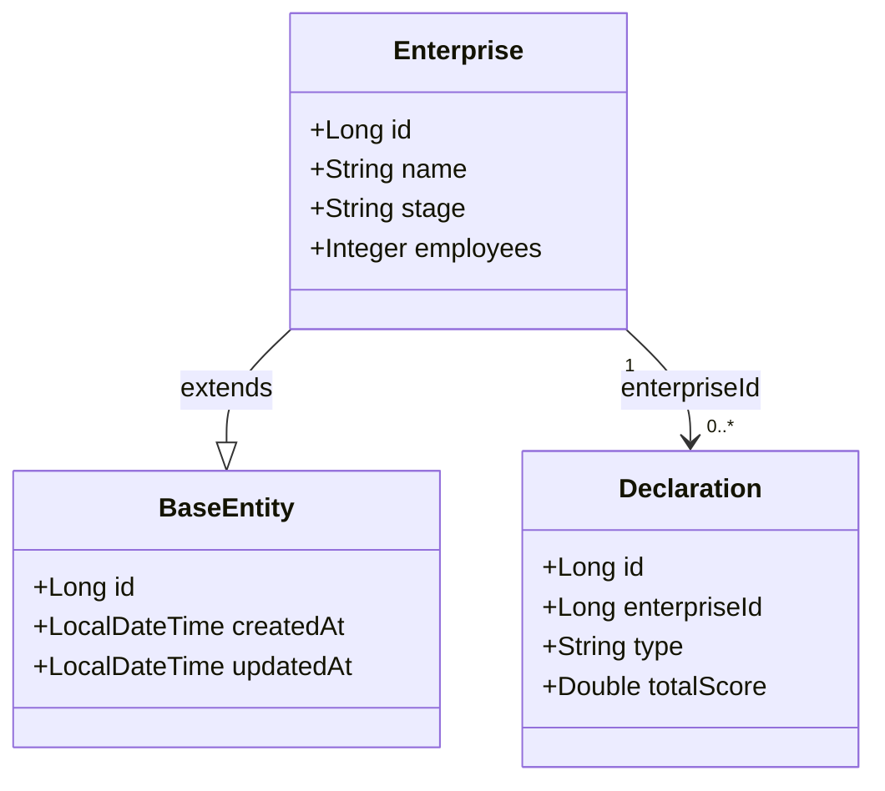

# Database Schema Documentation

> 本技能为数据库 schema 文档类技能的伞(umbrella),已吸收 `schema-doc-audit`(2026-08 合并)。
> 完整原文见 `references/absorbed-schema-doc-audit.md`。

Audit and document a project's database schema from multiple sources.

## Scope

Best suited for:
- Spring Boot + JPA projects (with or without Flyway)
- Any project with SQL DDL + entity classes + optional migration scripts
- Creating/maintaining `DATABASE.md`, `SCHEMA.md`, and ER diagrams
- Validating init.sql consistency after schema changes

## Workflow

### 1. Gather sources
- Read `init.sql` (or equivalent DDL) for each `CREATE TABLE`
- Read all Java `@Entity` classes in `domain/` directory
- Read any Flyway migration scripts (`db/migration/V*.sql`) if present
- Check `flyway_schema_history` in DDL for migration order (if Flyway was ever used)

### 2. Cross-reference every table

For each table:

```
table_name
  ├── init.sql columns → list all
  ├── Java entity fields → list all
  └── Migration history → which V scripts modified it (if migrations exist)
```

Key checks:
- Each Java field must have a matching SQL column (via `@Column(name=...)` or `camelCase→snake_case`)
- Each SQL column must have a Java field (or be a known legacy/auto column)
- Flag `@Column(name=...)` mappings that differ from the default camelCase→snake_case
- Check migration scripts for `CREATE TABLE` that would fail if table already exists
- Check migration scripts for Chinese characters or special characters in column names
- **CRITICAL**: After removing a column from any `CREATE TABLE`, verify every `INSERT INTO ... VALUES` block for that table still has the correct number of values. Use `execute_code` with a smart comma parser (respecting quoted strings and nested brackets) to count columns vs values programmatically.

### 3. Generate documentation

Write `docs/DATABASE.md` with:
- Table relationship diagram (ASCII or reference to SVG)
- Per-table field tables: field name, type, constraints, business meaning
- Group fields by function for large tables (e.g., declaration's 财务/研发/知识产权 sections)
- Migration history table (version → description → what changed)
- Encoding conventions and enum values

### 4. Generate diagrams

Three complementary views of the same schema. Use all three in different contexts — they serve different readers.

**MUST verify Mermaid syntax compiles.** Run `mermaid.parse()` in a browser console before claiming the diagram works. A `/` in comment strings renders as a blank error — do not assume the text is valid.

#### A) Architecture flowchart (system layers — for README / HANDBOOK)

Use `flowchart TD` with one `subgraph` per layer. Data layer is simplified to "N 张业务表" — no per-table detail. Point to DATABASE.md for the ER diagram.

```
mermaid
flowchart TD
    subgraph 用户层
        U1["企业用户"] --- U2["协会管理员"]
        U2 --- U3["政府管理员"]
        U3 --- U4["超级管理员"]
    end
    subgraph 接入层
        NG["Nginx 反向代理<br/>Static SPA + /api/ → Backend"]
    end
    subgraph 前端层
        FE["Vanilla JS SPA<br/>企业端 协会端 政府端"]
    end
    subgraph 后端层
        BE["Spring Boot<br/>8+ Controllers"]
    end
    subgraph 服务层
        SV["评分引擎 / OCR / AI / 文件"]
    end
    subgraph 数据层
        DB["MySQL · N 张业务表"]
    end
    subgraph 外部服务
        AI["DashScope API"]
    end
    U1 --> NG; U2 --> NG; U3 --> NG; U4 --> NG
    NG --> FE; NG --> BE
    BE --> SV; SV --> DB
    SV -.-> AI
```

External services use dashed lines (`-.->`). Keep labels short.

#### B) Mermaid ER diagram (database tables — for DATABASE.md)

Generate a ```` ```mermaid\nerDiagram\n```` block with:

- All tables with entity class comment (e.g. `Enterprise.java`)
- PK, FK, UK markers on key columns
- Chinese business name comments on important fields
- FK relationship lines with the FK column name as the label
- 8-15 key columns per table (enough to understand the schema, not every field)

**Syntax reference:**
```
erDiagram
    TABLE_NAME {
        type field_name PK|UK|FK "comment"
    }
    PARENT ||--o{ CHILD : "fk_column"
```

Cardinality: `||--o{` = one-to-many, `}o--||` = many-to-one, `||--||` = one-to-one.

**CRITICAL: Mermaid does NOT support `/` in attribute comment strings.** The `/` character causes a parse error. Replace with `-`:
```
# RIGHT:
varchar_32 role "ADMIN-GOVERNMENT-ASSOCIATION"
varchar_32 level "国家级-省级-市级-区级"
# WRONG (parse error):
varchar_32 role "ADMIN/GOVERNMENT/ASSOCIATION"
varchar_32 level "国家级/省级/市级/区级"
```

**Deriving FK relationships when DDL has no constraints:** Look for:
- `@ManyToOne` + `@JoinColumn(name="xxx_id")` in JPA entity classes
- Column naming convention `{target_table}_id` (e.g. `enterprise_id`, `declaration_id`)
- Cross-reference with actual column names in the DDL to confirm

#### C) Mermaid classDiagram (JPA entities — shows inheritance from BaseEntity)

For showing entity classes with inheritance (BaseEntity) and cardinality, use `classDiagram` alongside the `erDiagram`:



Key differences from `erDiagram`:
- Shows Java inheritance (`--|>`)
- Shows cardinality with quotes (`"1" --> "0..*"`)
- No column types in angle brackets — use clean field names
- Use `extends` as relationship label on inheritance
- Use FK field name as relationship label on associations

#### D) Standalone SVG/HTML ER diagram (fallback)

Create a standalone SVG/HTML ER diagram showing:
- All tables with their entity class names (`Enterprise.java`, etc.)
- Chinese business names below English names
- All columns (compact, key fields only)
- Foreign key relationships with orthogonal arrows (right-angle polylines ONLY)
- Foreign key field names on arrow labels
- Color-coded by module/category
- Legend explaining arrow and color semantics

#### When to use which

| Criterion | flowchart TD | erDiagram | classDiagram | Standalone SVG/HTML |
|-----------|-------------|-----------|--------------|---------------------|
| Purpose | Architecture layers | DB schema + columns | JPA entities + inheritance | Full control (any view) |
| Inheritance | No | No | Yes (`--|>`) | Yes (custom) |
| Environment | GitHub, VS Code | GitHub, VS Code | GitHub, VS Code | Anywhere |
| Maintenance | Inline in markdown | Inline in markdown | Inline in markdown | 1-2 extra files |
| Column detail | None | 8-15 key cols per table | Key fields only | Key fields + truncation notes |
| FK lines | Implicit (via layers) | Auto-drawn by Mermaid | Cardinality labels | Manual orthogonal polylines |

## Pitfalls

- **V5_2 duplicate CREATE TABLE**: If two migrations create the same table, the second fails. Fix: replace with `ALTER TABLE ADD COLUMN IF NOT EXISTS`.
- **Chinese column names**: MySQL allows them but they don't match Java camelCase→snake_case. Rename to English.
- **Duplicate columns from entity-application fields**: When migrations add "form snapshot" columns, they may duplicate existing column names with slight spelling variations (e.g., `ip_class1self` vs `ip_class1_self`).
- **init.sql vs migration chain**: init.sql is often the final DESIRED state; migration scripts may have bugs that init.sql bypasses. Always cross-reference both. When migrations are deleted entirely, init.sql becomes the sole source of truth.
- **Column removal breaks INSERT VALUES**: After removing a column from `CREATE TABLE`, every `INSERT INTO ... VALUES` block for that table must lose one value per row. MySQL errors with `Column count doesn't match value count at row 1`. Always verify by programmatically counting CREATE TABLE columns vs VALUES in each INSERT row — use Python with `execute_code`, parsing at top-level commas (respecting quoted strings `'...'`, JSON `{...}`/`[...]`, and nested brackets).
- **MySQL 8.0 collation requirement**: `init.sql` uses `utf8mb4_0900_ai_ci` which is MySQL 8.0+. MySQL 5.x will error `Unknown collation: 'utf8mb4_0900_ai_ci'` on any CREATE TABLE. If the deployment target is MySQL 5.7, either change all COLLATE clauses or upgrade MySQL.
- **Flyway checksums**: After fixing a migration script that was already applied, the checksum changes. Fixing already-applied scripts only helps fresh installs — existing DBs are unaffected.
- **Flyway disabled in production**: When `SPRING_FLYWAY_ENABLED=false` in Docker Compose, migration scripts are never executed. init.sql is the sole schema source. Any migration scripts still in the repo become dead documentation and can diverge from init.sql — either keep them in sync or delete them.
- **Mermaid `/` parse error**: `/` in attribute comment strings causes silent parse failure. Replace with `-` (e.g. `"ADMIN-GOVERNMENT-ASSOCIATION"` instead of `"ADMIN/GOVERNMENT/ASSOCIATION"`).
- **Mermaid syntax MUST be verified**: call `mermaid.parse()` in a browser (with Mermaid CDN loaded) before claiming it works. Silent parse errors render as a blank error message.
- **graphify integration**: Use `graphify` AST extraction on JPA entity Java files (free, no LLM) to produce a knowledge graph (110+ nodes, community detection maps 1:1 to entity classes). Derive FK relationships from the graph's edge data and column naming conventions. This is faster and more accurate than manual extraction.
- **HTML-to-Mermaid migration**: When replacing standalone HTML/SVG diagrams with inline Mermaid, the Mermaid diagram must be comprehensive enough to replace ALL content of the old file. A partial subset that just "covers the main tables" is not enough — include the same level of column detail the HTML had.

## ER Diagram SVG Standards

- Use dark theme with `#0f172a` background
- Arrow markers: `<marker id="arrow">` with right-angle polylines, `stroke="#64748b" stroke-width="1.5"`
- Table header: 32px height, subtitle fill at y+16 h=16
- Header layout (3 lines in 32px header):
  - English name: `y+24` (bold, 13px)
  - Chinese name: `y+29` (small, 8px, inside subtitle fill)
  - Java class: `y+24` (right-aligned, italic, 9px)
- Field text: 9px, `#94a3b8`, first field at `y+56` from table top (24px below header bottom)
- Arrow routing: ALWAYS orthogonal. Use `<polyline>` with 3+ points for horizontal→vertical→horizontal paths. Never diagonal `line` elements with rotated text labels.
