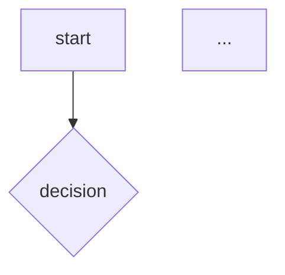

# Quant Research Report

Write a structured quantitative finance research report from source materials (task brief PDF, email, reference documents). Used for Virtual Internship tasks and similar academic/professional quant assignments.

## When to trigger

- User provides a task brief (PDF/image/email) and says "写报告"
- User says "把报告写了" or "写research report"
- User provides reference documents + asks to produce structured output
- Combining multiple sources (email instructions + PDF brief + reference doc) into one report

## Workflow

### 1. Gather all source materials

Read every source before writing:
- Task brief PDFs (extract text via PyMuPDF; if image-based, convert to PNG and use vision_analyze)
- Email instructions (search agently-cli, read full message)
- Reference documents (eFX guides, algo strategy documents)
- Previous plan.md if one exists

```bash
# Extract text from PDF
python3 -c "
import fitz
doc = fitz.open('path/to/file.pdf')
for i, page in enumerate(doc):
    text = page.get_text()
    if text.strip():
        print(f'--- Page {i+1} ---')
        print(text)
    else:
        print(f'Page {i+1}: image-based, need vision')
doc.close()
"

# For image-based PDFs, convert to PNG and use vision_analyze
python3 -c "
import fitz
doc = fitz.open('path.pdf')
for i, page in enumerate(doc):
    pix = page.get_pixmap(dpi=300)
    pix.save(f'page_{i+1}.png')
doc.close()
"
```

### 2. Create plan.md first (if not already present)

Structure the plan following the source document's outline. Write in Chinese with English parenthetical annotations.

### 3. Write the report (report.md)

## Report structure

```
# Task N — Research Report Title

**Name:** [Student Name]
**Date:** [Date]
**Deadline:** [As specified]

---

## 01 — Section Title

### A. Subtopic

Content...

---

## 02 — Next Section
```

### Section formatting rules

**A. Market details / factual content:**
- Use concise paragraphs, not bullet lists for explanations
- Tables for comparison/contrast (time periods, rule differences)
- Dot lists only for short standalone items (parameters, features)
- Write in Chinese, English keywords in parentheses `（English Term）`

**B. Parameter documentation (dot list, not table):**
```markdown
**参数：**

- **ParameterName** — 说明文字
- **AnotherParam** — 说明文字
```
NEVER use a table for parameter lists. Use ` — ` (space emdash space) between name and description.

**C. Time format:**
Use `X:XX AM/PM ET` format consistently. Never 24-hour format.
- Pre-market: `4:00 AM – 9:30 AM ET`
- Regular: `9:30 AM – 4:00 PM ET`
- After-hours: `4:00 – 8:00 PM ET`

**D. Similar items (merge, don't separate):**
When Nasdaq and NYSE have the same rules, state once as "两者一致，均为...". Do NOT write parallel sections for each exchange unless they actually differ.

**E. Comparison tables (when contrasting is needed):**
Use markdown tables with clear column headers. Example:
```markdown
| 方面 | 开盘竞价 | 收盘竞价 |
|------|----------|----------|
| 时间 | 9:30 AM ET | 4:00 PM ET |
| 竞价窗口 | ... | ... |
```

**F. Processing lists (pros/cons, issues):**
Use dot lists with ` — ` separator:
```markdown
- **问题名** — 说明文字
- **另一个问题** — 说明文字
```

**G. Algorithms (Mermaid + Python):**
Each algorithm gets:
1. **定义/使用场景/参数** (dot list)
2. **Mermaid flowchart** showing the logic flow
3. **Python code** with classes, dataclasses, type hints
4. **边界情况** (dot list covering: 订单未完成, 流动性不足, 开盘/收盘竞价)

```markdown
### i. AlgorithmName

**定义：** ...
**使用场景：** ...
**参数：**
- **Param** — description



```python
class AlgorithmName:
    def run(self, ...):
        ...
```

**边界情况：**
- **订单未完成** — ...
- **流动性不足** — ...
- **开盘/收盘竞价** — ...
```

**H. Broker implementation differences:**  
Use a 5-column table: `维度 | Side A | 后果 | Side B | 后果`. Each row shows one dimension, both possible implementations, and the consequence of each. Never use vague labels like "经纪商 A / 经纪商 B" without explaining what differs or what the tradeoff is. Reference actual parameters from source docs, not generic guesswork.

```markdown
| 维度 | Side A | 后果 | Side B | 后果 |
|------|--------|------|--------|------|
| **Whisper Urgency** | 0%=near side | 被动冲击小 | 扩展至0-100% | 主动快但滑点高 |
```

**I. Metrics table:**
Use a 4-column table: 指标 | 定义 | 适用算法 | 目标

**J. Edge cases — REQUIRED for every algorithm section:**
The 3 mandatory edge cases are:
1. **订单未完成 (Order incompletion)** — timeout handling, partial fills, force close
2. **流动性不足 (Inadequate liquidity)** — spreading widening, switching venues, internal/external liquidity
3. **开盘/收盘竞价 (Open & close auctions)** — auction period detection, pausing during freeze, auction participation

## Source document discipline

- Algorithm definitions, parameters, and use cases MUST match the source document exactly. Do NOT invent parameters or behaviors.
- When the source document specifies Urgency levels (Low 15%, Normal 25%, High 45%), use those exact values.
- When the source specifies parameter names (Urgency, If Limit, TP Price, Include External Liquidity, Exposed %), use those names.
- The Python implementation should demonstrate the algorithm's core logic, not be a fully executable trading system.

## Style rules

**中文/英文报告：** 默认中文，正文中文（关键词英文括号备注）。如果用户要求英文，用 Title Case 标题，保持同样结构、表格、公式和边界情况。
- **Dot lists** (`- **Item** — description`) for parameters, features, edge cases
- **Tables** only for comparison matrices and metrics
- **Mermaid** for flowcharts, not ASCII art or code blocks
- **Python** for code, not pseudo-code in code fences
- **No introductory commentary** about what you're about to write. Just the content.
- **References section** at the end with numbered list

### English report anti-AI-ism rules

When writing in English, strip every word that sounds AI-generated. Zero tolerance — a single "comprehensive" or "delve" in a 500-line report is one too many.

**Watchlist — never use:**

| Category | Words/Phrases |
|----------|--------------|
| Fluff adjectives | `comprehensive`, `robust`, `seamless`, `cutting-edge`, `state-of-the-art`, `vital`, `crucial`, `transformative` |
| Self-referential | `Let's delve into`, `I hope this helps`, `feel free to`, `please note`, `it's worth noting`, `in conclusion`, `in summary` |
| Empty transitions | `Moreover`, `Furthermore`, `Additionally`, `It is important to`, `It should be noted that` |
| Explanation of self | Don't say "This section discusses X" — just present X. Don't say "The following table shows" — just show the table. |
| Hedge words | `generally`, `typically`, `essentially`, `basically`, `arguably` |
| AI boilerplate | `Let's walk through`, `Let's take a closer look`, `When it comes to`, `What this means is` |

**English heading style:** Title Case for H1/H2/H3 (capitalise major words, lowercase articles/conjunctions/prepositions). Match the source document's exact terminology when the task provides a title — Title Case overrides source casing only when the user explicitly asks for Title Case.

**English content tone:**
- Factual, direct, no explanatory preamble
- "Pair trading is a market-neutral strategy..." not "As we discussed earlier, pair trading is..."
- "JPM vs GS, 2010–2018" not "Let's take a look at an example of JPM vs GS..."

## Pitfalls

1. **Separating identical items** — User corrected: don't write "Nasdaq: xxx / NYSE: xxx" when they're the same. State once, say they're identical.
2. **Parameter tables** — User prefers dot lists (`- **Name** — description`) over markdown tables for parameters. Only use tables for comparison matrices.
3. **Code blocks** — Code blocks only for actual code (Python) and mermaid. Never use a code block for pseudo-code or numbered procedural steps - use regular markdown lists.
4. **Not matching source doc parameters** — User explicitly required strict adherence. Read the source doc carefully and use exact parameter names and values.
5. **Missing edge cases** — Every algorithm must have the 3 edge cases listed explicitly. Not implied by the code - written out in a section.
6. **Skipping metrics table in section 04** — When the task asks for "devise metrics for each algorithm", provide an actual table, not a note saying "保持不变".
7. **AI boilerplate at section starts** — Don't say "参考以下为每个算法编写的..." Keep it clean. Just the section header and content.
8. **Time format inconsistency** — All times must be `X:XX AM/PM ET`, not 24-hour or abbreviated.
9. **Missing Python syntax verification** — After writing Python code blocks, verify with ast.parse that all blocks are syntactically valid.
11. **Over-explaining obvious code** — Python code blocks should show the algorithm logic. Docstrings and comments on public methods are OK; don't comment trivial lines like `return qty`.
12. **English section headers not matching source doc titles** — The task PDF's section headers (e.g. "Agency Trading algorithms" with lowercase 'a', or section 04 having no subtitle) define the canonical terminology. Read the source doc header text via vision_analyze if needed. Don't invent subtitles for sections the source leaves untitled. Don't capitalise words the source intentionally lowercase-d.
13. **Section 03 reference-line removed but not replaced** — When removing the "参考以下..." line from section 03 start, the structure still works. But make sure the edge case sections after each algorithm are present — they're required by the task.
14. **Broker table with no consequences** — The Side A / Side B table MUST include the Consequence column for each. A table that only lists differences without explaining what they mean is incomplete.
15. **Given-before-known when the reader may lack domain knowledge** — If the report could be read by someone who doesn't know the domain (user: "目标读者并不了解 Fed Fund Rate 或 SOFR"), audit for given-before-known violations: front-load a one-line-per-term glossary before the story, gloss each technical term at its FIRST occurrence, and fix data/statement inconsistencies the audit surfaces. Never make the reader meet a term raw on page 1 and only define it on page 10.
