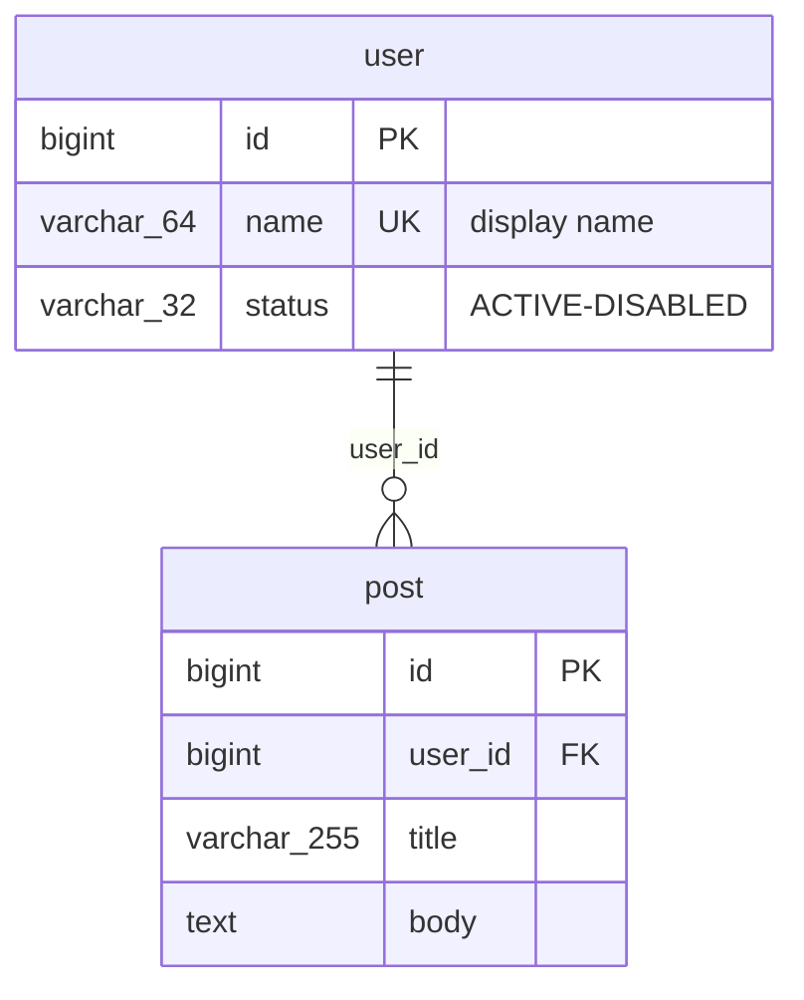
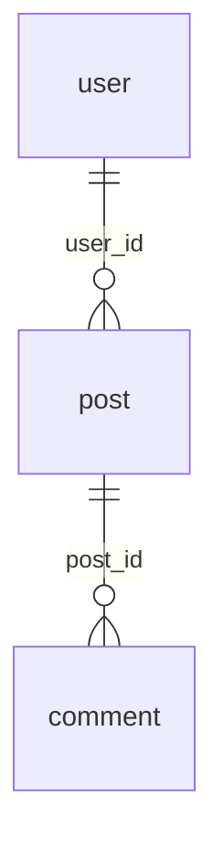
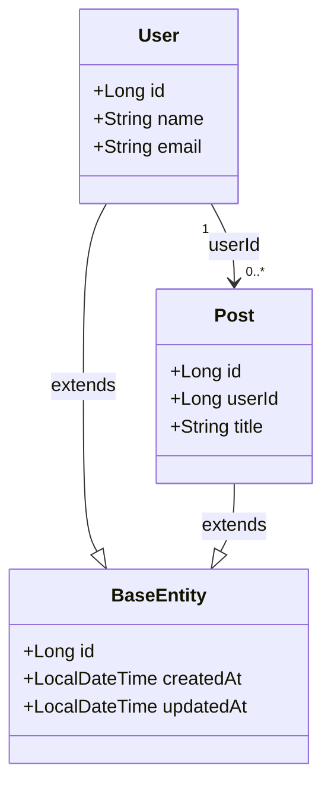
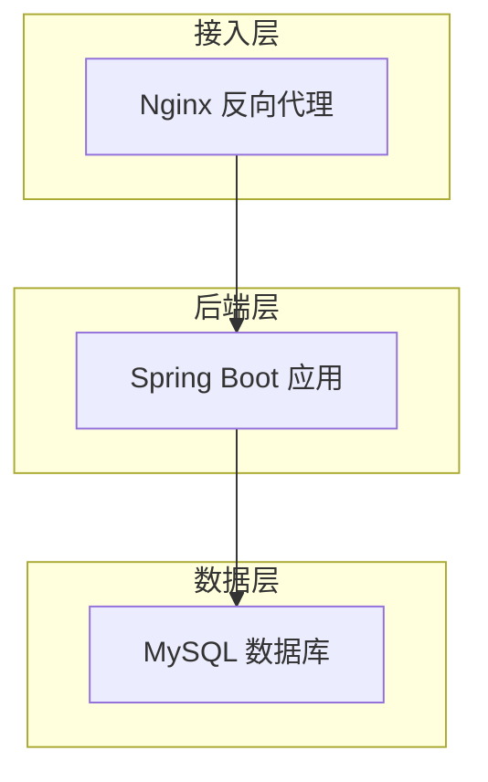
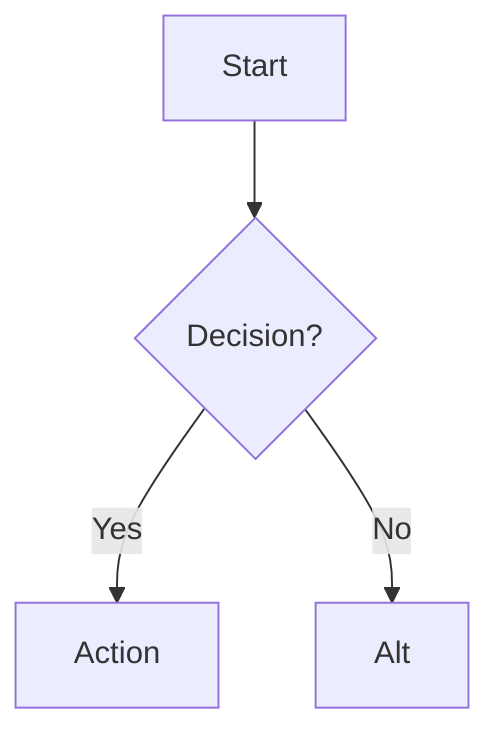

# Mermaid Diagrams — Authoring Skill

Mermaid inline diagrams (` ```mermaid `) render in GitHub/GitLab markdown, Obsidian, and most modern markdown viewers. This skill covers the three types most useful for project documentation.

## When to Use

- User asks to add/update architecture, ER, or class diagrams in markdown docs
- Replacing external HTML/SVG diagram files with inline Mermaid
- Any documentation task that benefits from visual structure (table relationships, layered architecture, entity inheritance)

---

## Diagram Types

### 1. erDiagram — Entity-Relationship (Database Schema)

Best for: showing database tables, their columns, and FK relationships between them.

**Syntax rules:**
- `erDiagram` keyword on first line
- `TABLE_NAME { type field_name PK/FK "comment" }` for each table
- Relationship lines: `SOURCE ||--o{ TARGET : "fk_name"`
- Cardinality: `||--o{` (1 to many), `}o--||` (many to 1), `||--||` (1 to 1), `}o--o{` (many to many)



**⚠️ Critical pitfall: No `/` in comment strings.**
The slash character `/` inside quoted comments causes a Mermaid parse error:
```
varchar_32 status "ACTIVE/DISABLED"   ← PARSE ERROR
varchar_32 status "ACTIVE-DISABLED"   ← OK
```
Replace `/` with `-` or `·` or remove the comment. This applies to ALL inline strings in ALL Mermaid diagram types. **Exception:** `<br/>` inside flowchart node labels is the standard line-break tag and parses fine — keep it, don't strip the slash there.

**Relationship-only mode** (no field definitions, just FK lines between anonymous tables):

Useful for high-level overviews in handover docs where detail lives in a separate reference file.

**Pair with a reference link** after the simplified diagram so readers know where to find the full schema:
```markdown
详见 [docs/DATABASE.md](docs/DATABASE.md)（完整 ER 图含字段、实体类图含继承、字段清单）。
```
This keeps overview docs concise while maintaining discoverability to the authoritative source.

### 2. classDiagram — UML Class Diagram (JPA Entities)

Best for: showing Java/C# entity classes, their fields, inheritance hierarchy, and association cardinality.



**Key syntax:**
- `--|>` — inheritance (arrow to parent)
- `"1" --> "0..*"` — association with cardinality
- `-->` — plain association
- `+` before field name = public visibility
- Comments in quotes after field type (works only on `classDiagram`, not `erDiagram`)

### 3. flowchart — Architecture / Process Flow

Best for: layered architecture, deployment topology, business process flows.



**Key syntax:**
- `flowchart TD` — top-down; `flowchart LR` — left-to-right
- `subgraph NAME ... end` — group related nodes
- `--->` — solid arrow; `-.->` — dashed arrow (for async/external calls)
- `<br/>` — line break inside node text
- `node1 & node2 & node3 --> target` — multiple sources to one target

### 4. Algorithm Flowchart + Code Pairs

For documenting trading algorithms or processing logic, pair a `flowchart` with a detailed code block:

**Pattern:** flowchart shows the *decision logic and branching*; code block shows *data flow and parameter behavior*.

```
**定义：** Description
**使用场景：** When to use

**参数：** (table)



```python
class Algorithm:
    ...
```

**Edge cases:** bullet list after the code block.

Each algorithm gets its own `---` separator.

---

## Verification Workflow

**Always verify Mermaid syntax before committing.** Mermaid parse errors render as an error banner (not the diagram) in markdown viewers, and they're silent failures — no test or compiler catches them.

### Browser-based verification (fastest):

```javascript
// In browser console after loading mermaid.min.js (CDN or local):
mermaid.parse(`erDiagram
    user ||--o{ post : "user_id"
`)
// Returns true if valid, throws with line:col on error
```

**Concrete no-install recipe (agent-friendly):** write a temp HTML that loads the CDN build and records the parse result in `document.title`, open it with the browser tool, read the title:

```html
<script src="https://cdn.jsdelivr.net/npm/mermaid@10/dist/mermaid.min.js"></script>
<script>
try { mermaid.parse(`<diagram text>`); document.title = "MERMAID_OK"; }
catch (e) { document.title = "MERMAID_ERR: " + e.message; }
</script>
```

`browser_navigate` to the `file://` path → title `MERMAID_OK` means valid. Delete the temp file afterwards (it often lives in a gitignored scratch dir).

### CLI verification (via Puppeteer):

```bash
npx @mermaid-js/mermaid-cli -i /dev/stdin -o /dev/null 2>&1 <<< '
erDiagram
    user ||--o{ post : "user_id"
'
# Exit code 0 = valid
```

### After fixing syntax errors:

1. Replace all `/` in quoted strings with `-`
2. Verify the block has matching ` ```mermaid ` and ` ``` ` delimiters
3. Check for stray characters between the diagram and following markdown content
4. Run `mermaid.parse()` on the full block text

---

## Pitfalls

- **`/` in quoted strings breaks all diagram types** — the most common silent failure. Always scan for `/` inside `""` in mermaid blocks.
- **Double ` ``` ``` ` fences** — after copy-pasting or scripted replacement, check there aren't two consecutive closing fences.
- **Chinese characters in labels work** — Mermaid supports Unicode in quoted strings (as long as no `/`).
- **Large diagrams (>30 entities) may overflow** — markdown renderers can truncate or slow down. Consider relationship-only mode for overviews, link to full detail separately.
- **Mermaid v10+ only** — older renderers (< v9) may not support `flowchart` subgraphs or `classDiagram` cardinality syntax. GitHub supports v10+.

## References

- `references/er-diagram-syntax.md` — Full reference: erDiagram syntax, examples
- `references/class-diagram-syntax.md` — Full reference: classDiagram syntax, cardinality table
