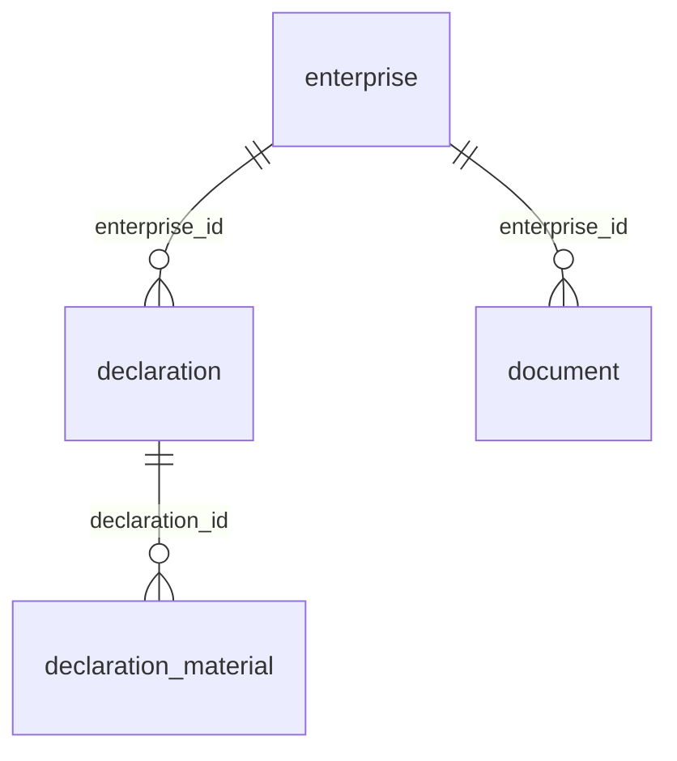

# ER Diagram — Full Syntax Reference

## Field Definition Pattern

```
TABLE_NAME {
    type field_name PK/FK "comment"
}
```

- `type` — any string label (bigint, varchar_64, text, json, double)
- `field_name` — snake_case
- `PK`, `FK`, `UK` — key type markers (optional, order doesn't matter)
- `"comment"` — optional quoted description
- **No `/` allowed** inside the quoted comment

### Valid examples:
```
bigint id PK
varchar_64 name UK "user display name"
varchar_32 status "ACTIVE-DISABLED"
```

### Invalid:
```
varchar_32 status "ACTIVE/DISABLED"   ← PARSE ERROR
```

## Relationship Patterns

| Pattern | Meaning | Example |
|---------|---------|---------|
| `||--o{` | one → many (required) | `user ||--o{ post` |
| `}o--||` | many → one (optional) | `comment }o--|| post` |
| `||--||` | one → one | `user ||--|| profile` |
| `}o--o{` | many → many | `student }o--o{ course` |
| `}|--o{` | one → many (optional parent) | |

## No-Fields Mode

Relationship lines alone (no `{ }` blocks) render as anonymous table boxes with just the FK labels. Useful for handover doc overviews:


